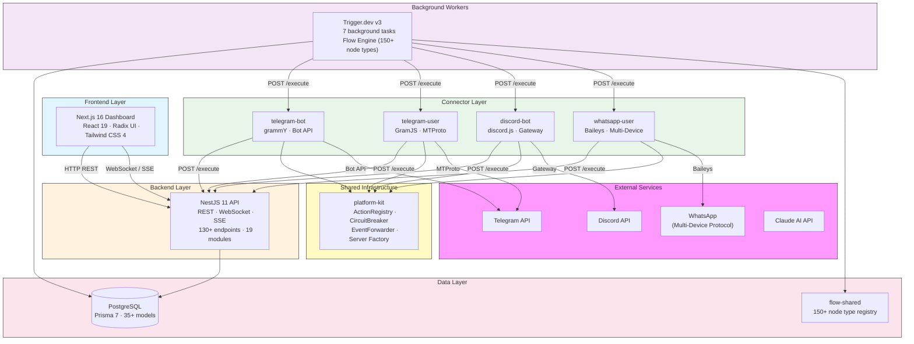
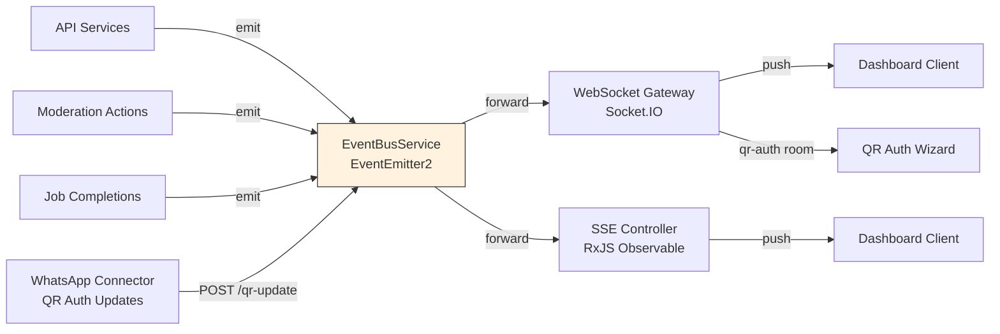
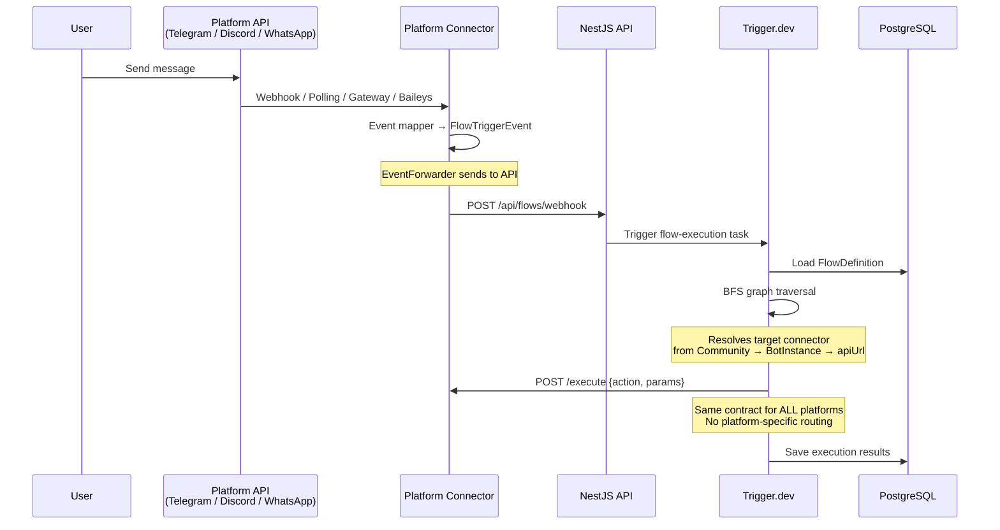
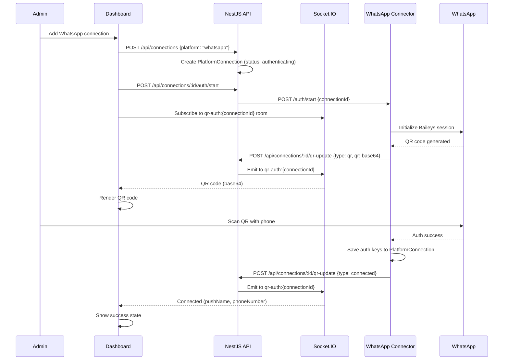
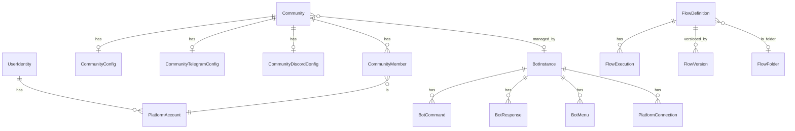

<p align="center">
  <h1 align="center">Flowbot</h1>
  <p align="center">
    Multi-platform bot management and visual flow automation platform
    <br />
    <strong>Telegram &middot; Discord &middot; WhatsApp &middot; Visual Flow Builder &middot; Real-Time Dashboard</strong>
  </p>
</p>

<p align="center">
  
  
  
  
  
  
</p>

---

## What is Flowbot?

Flowbot is an all-in-one platform for managing communities across **Telegram, Discord, WhatsApp, and more** with a visual automation engine. It combines:

- **Visual Flow Builder** — drag-and-drop automation with 150+ node types across Telegram, Discord, WhatsApp, and cross-platform actions
- **Unified Connector Architecture** — every platform connector follows the same pattern: ActionRegistry + Valibot schemas + EventForwarder + standard HTTP contract
- **Admin Dashboard** — real-time monitoring, analytics, multi-platform broadcast, community management, bot configuration
- **Background Job Engine** — reliable task execution with Trigger.dev for broadcasts, scheduled messages, flow execution
- **Telegram User Account** — MTProto client that acts as a real user for advanced operations bots can't do
- **WhatsApp User Account** — Baileys client with QR code auth, session persistence, group management, and full messaging

---

## Architecture

### Connector Pattern

Every platform connector follows the same architecture. A **connector package** contains the SDK wrapper, action handlers, and event mapper. A **thin shell app** (~50 lines) boots the connector and starts the HTTP server.

```
┌─────────────────────────────────────────────────────────┐
│  platform-kit (shared infrastructure)                    │
│  ActionRegistry · CircuitBreaker · EventForwarder        │
│  ConnectorError · createConnectorServer()                │
└─────────────┬───────────────────────────────┬───────────┘
              │                               │
   ┌──────────▼──────────┐       ┌───────────▼───────────┐
   │  *-connector pkg    │       │  *-connector pkg      │
   │  SDK wrapper         │       │  SDK wrapper           │
   │  Action handlers     │       │  Action handlers       │
   │  Event mapper        │       │  Event mapper          │
   │  Valibot schemas     │       │  Valibot schemas       │
   └──────────┬──────────┘       └───────────┬───────────┘
              │                               │
   ┌──────────▼──────────┐       ┌───────────▼───────────┐
   │  apps/* thin shell  │       │  apps/* thin shell    │
   │  ~50 lines          │       │  ~50 lines            │
   │  POST /execute      │       │  POST /execute        │
   │  GET /health        │       │  GET /health          │
   │  GET /actions       │       │  GET /actions         │
   └─────────────────────┘       └───────────────────────┘
```

Every connector exposes the same HTTP contract:
- `POST /execute` — `{ action, params }` → `{ success, data?, error? }`
- `GET /health` — `{ status, uptime, connected }`
- `GET /actions` — list of registered action names + schemas

The dispatcher is platform-agnostic (~150 lines) — it resolves a community's bot instance URL and sends `{ action, params }`. No platform-specific routing.

### System Overview



### Real-Time Event System



### Data Flow: Message Processing



### Data Flow: WhatsApp QR Authentication



---

## Monorepo Structure

```
flowbot/
├── apps/
│   ├── telegram-bot/              # Thin shell — boots telegram-bot-connector
│   ├── telegram-user/             # Thin shell — boots telegram-user-connector
│   ├── discord-bot/               # Thin shell — boots discord-bot-connector
│   ├── whatsapp-user/             # Thin shell — boots whatsapp-user-connector
│   ├── api/                       # NestJS REST API + WebSocket + SSE
│   ├── frontend/                  # Next.js admin dashboard (44 pages)
│   └── trigger/                   # Trigger.dev worker (7 tasks) + flow engine
├── packages/
│   ├── platform-kit/              # Shared: ActionRegistry, CircuitBreaker, EventForwarder, server factory
│   ├── telegram-bot-connector/    # grammY Bot API — actions, events, features
│   ├── telegram-user-connector/   # GramJS MTProto — user-account actions
│   ├── discord-bot-connector/     # discord.js — actions, events, features
│   ├── whatsapp-user-connector/   # Baileys — actions, events, QR auth
│   ├── db/                        # Prisma 7 schema + client (35+ models)
│   └── flow-shared/               # Node type registry (150+ types)
├── scripts/                       # Data migration scripts
├── docs/
│   ├── architecture.md            # Detailed architecture docs
│   └── superpowers/               # Design specs + implementation plans
├── docker-compose.yml             # PostgreSQL + connector services
└── tsconfig.base.json             # Shared TypeScript config
```

### Workspaces

| Workspace | Path | Stack | Role |
|-----------|------|-------|------|
| Telegram Bot | `apps/telegram-bot` | Thin shell (~50 lines) | Boots telegram-bot-connector, exposes `/execute` |
| Telegram User | `apps/telegram-user` | Thin shell (~50 lines) | Boots telegram-user-connector, exposes `/execute` |
| Discord Bot | `apps/discord-bot` | Thin shell (~50 lines) | Boots discord-bot-connector, exposes `/execute` |
| WhatsApp User | `apps/whatsapp-user` | Thin shell (~50 lines) | Boots whatsapp-user-connector, exposes `/execute` |
| API | `apps/api` | NestJS 11 | REST API, WebSocket, SSE — serves dashboard and coordinates all services |
| Frontend | `apps/frontend` | Next.js 16, React 19 | Admin dashboard — communities, flows, connections, broadcast, analytics |
| Trigger Worker | `apps/trigger` | Trigger.dev v3 | Background jobs + flow execution engine (BFS traversal, action dispatch) |
| Platform Kit | `packages/platform-kit` | TypeScript, Hono, Valibot | ActionRegistry, CircuitBreaker, EventForwarder, server factory (29 tests) |
| Telegram Bot Connector | `packages/telegram-bot-connector` | grammY, Valibot | Bot API actions, event mapper, features (75 tests) |
| Telegram User Connector | `packages/telegram-user-connector` | GramJS, Valibot | MTProto user-account actions (95 tests) |
| Discord Bot Connector | `packages/discord-bot-connector` | discord.js, Valibot | Gateway actions, event mapper (116 tests) |
| WhatsApp User Connector | `packages/whatsapp-user-connector` | Baileys, Valibot | Multi-device actions, event mapper, QR auth (86 tests) |
| DB | `packages/db` | Prisma 7 | Database schema + generated client (35+ models) |
| Flow Shared | `packages/flow-shared` | TypeScript | Node type registry (150+ types) shared between frontend and trigger |

### Platform Connectors

Each platform is split by **identity** (bot account vs user account). Each cell is one connector:

|  | Bot Account | User Account |
|---|---|---|
| **Telegram** | `telegram-bot-connector` (grammY, Bot API) | `telegram-user-connector` (GramJS, MTProto) |
| **Discord** | `discord-bot-connector` (discord.js, Gateway) | _(future)_ |
| **WhatsApp** | _(n/a — no bot concept)_ | `whatsapp-user-connector` (Baileys, Multi-Device) |

Every connector:
- Registers typed action handlers via `ActionRegistry` with Valibot schema validation
- Maps platform events to `FlowTriggerEvent` via `EventForwarder`
- Wraps the platform SDK (grammY, GramJS, discord.js, Baileys) in a testable interface
- Includes a `FakeClient` test double for isolated unit testing
- Is hosted by a thin shell app exposing `POST /execute`, `GET /health`, `GET /actions`

---

## Key Features

### Visual Flow Builder

The flow engine supports **170+ node types** for building cross-platform automations:

```mermaid
graph LR
    subgraph Triggers["Triggers (30+)"]
        T1["Telegram Events (14)"]
        T2["Discord Events (6)"]
        T3["WhatsApp Events (7)
        message, join, leave,
        promote, demote, group, presence"]
        T4["General (3)
        schedule, webhook, custom_event"]
    end

    subgraph Conditions["Conditions (17)"]
        C1["Telegram (11)"]
        C2["Discord (5)"]
        C3["Context (1)"]
    end

    subgraph Actions["Actions (120+)"]
        A1["Telegram Bot Actions (22)"]
        A2["Telegram User Account (18)"]
        A3["Discord (30)"]
        A4["WhatsApp (19)"]
        A5["Unified Cross-Platform (10)"]
        A6["Context & Utility (6)"]
    end

    subgraph Advanced["Advanced (7)"]
        X1["run_flow, emit_event"]
        X2["parallel_branch, loop"]
        X3["switch, transform, db_query"]
    end

    Triggers --> Conditions
    Conditions --> Actions
    Actions --> Advanced
    Advanced -->|"chain"| Triggers
```



Features:
- BFS graph traversal with LRU result caching
- Variable interpolation: `{{trigger.*}}`, `{{node.*}}`, `{{context.*}}`
- Persistent per-user context (`get_context` / `set_context`)
- Flow chaining with `run_flow` + `triggerAndWait` (max depth: 5)
- Cross-platform: Telegram trigger can feed Discord/WhatsApp actions and vice versa
- Visual debugger with step-through execution timeline

### Telegram User Account (MTProto)

User accounts can do things bots can't:
- Access private groups and channels
- Read full chat history and search messages
- Send messages without the "bot" badge
- Join/leave groups, create groups and channels
- Invite users by phone number or username

### WhatsApp Integration (Baileys)

- Send/receive text, media, documents, locations, contacts, and stickers
- Group management — kick, promote, demote; get group metadata and invite links
- Read message history and manage messages (edit, delete, forward)
- Presence and status updates
- Dashboard QR code auth — scan with your phone, session auto-persists

### Background Tasks (Trigger.dev)

| Task | Queue | Schedule | Description |
|------|-------|----------|-------------|
| `broadcast` | default | On-demand | Multi-platform broadcast to target communities |
| `cross-post` | default | On-demand | Syndicate messages across communities and platforms |
| `scheduled-message` | default | `* * * * *` | Deliver due messages every minute |
| `flow-execution` | `flows` | On-demand | Execute flow definitions (BFS engine) |
| `flow-event-cleanup` | default | `0 3 * * *` | Prune expired events daily |
| `analytics-snapshot` | default | `0 2 * * *` | Capture community analytics daily |
| `health-check` | default | `*/5 * * * *` | System health monitoring |

---

## Database Schema



**35+ models** across these domains:

| Domain | Models |
|--------|--------|
| Identity | `PlatformAccount`, `UserIdentity` |
| Communities | `Community`, `CommunityConfig`, `CommunityTelegramConfig`, `CommunityDiscordConfig`, `CommunityMember` |
| Connections | `PlatformConnection`, `PlatformConnectionLog` |
| Analytics | `CommunityAnalyticsSnapshot`, `ReputationScore` |
| Broadcast | `BroadcastMessage`, `CrossPostTemplate` |
| Moderation | `Warning`, `ModerationLog`, `ScheduledMessage` |
| Flow Engine | `FlowDefinition`, `FlowFolder`, `FlowExecution`, `FlowVersion`, `UserFlowContext`, `FlowEvent` |
| Bot Config | `BotInstance`, `BotCommand`, `BotResponse`, `BotMenu`, `BotMenuButton` |
| Webhooks | `WebhookEndpoint` |

---

## API Modules

| Module | Endpoints | Purpose |
|--------|-----------|---------|
| `auth` | `/api/auth/*` | Login, token verification |
| `platform` | _(global)_ | Platform strategy registry |
| `identity` | `/api/accounts/*`, `/api/identities/*` | Platform accounts, cross-platform identity linking |
| `communities` | `/api/communities/*` | Community CRUD, config, members, warnings, logs, scheduled messages |
| `connections` | `/api/connections/*` | Platform connections, auth flows, health |
| `broadcast` | `/api/broadcast/*` | Broadcast management (multi-platform) |
| `flows` | `/api/flows/*` | Flow CRUD, versioning, execution, analytics |
| `webhooks` | `/api/webhooks/*` | Webhook endpoints |
| `bot-config` | `/api/bot-config/*` | Bot instance configuration, heartbeat |
| `reputation` | `/api/reputation/*` | Account/identity/community reputation scores |
| `analytics` | `/api/analytics/*` | Community analytics snapshots |
| `automation` | `/api/automation/*` | Automation health and jobs |
| `system` | `/api/system/*` | Health checks |
| `events` | `/api/events/*` | WebSocket + SSE streams |

---

## Getting Started

### Prerequisites

- Node.js 20+
- pnpm 10+
- Docker (for PostgreSQL)

### Setup

```bash
pnpm install
docker compose up -d
pnpm db prisma:migrate
pnpm db generate
pnpm db build
```

### Development

```bash
pnpm api start:dev          # API on port 3000
pnpm telegram-bot dev       # Telegram bot connector
pnpm telegram-user dev      # Telegram user connector
pnpm discord-bot dev        # Discord bot connector
pnpm whatsapp-user dev      # WhatsApp user connector on port 3004
pnpm frontend dev           # Dashboard on port 3001
pnpm trigger dev            # Trigger.dev worker
```

### Testing

```bash
pnpm api test                           # Jest (238 tests)
pnpm platform-kit test                  # Vitest (29 tests)
pnpm telegram-bot-connector test        # Vitest (75 tests)
pnpm telegram-user-connector test       # Vitest (95 tests)
pnpm discord-bot-connector test         # Vitest (116 tests)
pnpm whatsapp-user-connector test       # Vitest (86 tests)
pnpm trigger test                       # Vitest
```

### Build

```bash
pnpm api build
pnpm frontend build
```

---

## Environment Variables

| App | Required |
|-----|----------|
| Shared | `DATABASE_URL` |
| Telegram Bot | `BOT_TOKEN`, `BOT_MODE`, `BOT_ADMINS`, `LOG_LEVEL`, `SERVER_HOST`, `SERVER_PORT`, `API_SERVER_HOST`, `API_SERVER_PORT` |
| Telegram User | `TG_SESSION_STRING`, `TG_API_ID`, `TG_API_HASH`, `SERVER_PORT` (default 3005) |
| Discord Bot | `DISCORD_BOT_TOKEN`, `DISCORD_BOT_INSTANCE_ID`, `API_URL`, `SERVER_PORT` |
| WhatsApp User | `WA_CONNECTION_ID`, `WA_BOT_INSTANCE_ID`, `DATABASE_URL`, `API_URL`, `SERVER_PORT` (default 3004) |
| Trigger | `DATABASE_URL`, `TG_CLIENT_API_ID`, `TG_CLIENT_API_HASH`, `TG_CLIENT_SESSION`, `TELEGRAM_BOT_API_URL` |
| API | `DATABASE_URL`, `PORT`, `FRONTEND_URL` |
| Frontend | `NEXT_PUBLIC_API_URL` |

Docker Compose: PostgreSQL on port 5432 (`postgres`/`postgres`/`flowbot_db`).

---

## Startup Order


```bash
docker compose up -d                    # 1. PostgreSQL
pnpm db prisma:migrate && pnpm db generate && pnpm db build  # 2. Migrations
pnpm api start:dev                      # 3. API
pnpm telegram-bot dev                   # 4. Connectors
pnpm telegram-user dev                  # 4. Connectors
pnpm discord-bot dev                    # 4. Connectors
pnpm whatsapp-user dev                  # 4. Connectors
pnpm frontend dev                       # 5. Frontend
pnpm trigger dev                        # 6. Trigger.dev
```

---

## Security

- **Authentication** — JWT bearer tokens via global `AuthGuard`, public routes use `@Public()` decorator
- **CORS** — restricted to `FRONTEND_URL`
- **Webhook Security** — unique auto-generated cuid tokens per endpoint
- **Flow Engine Safety** — `db_query` allowlisted queries only (max 100 records), `run_flow` max depth of 5, circular reference detection
- **Transport Resilience** — generic CircuitBreaker in platform-kit prevents cascading failures to all platform APIs
- **Input Validation** — Valibot schemas on every action handler, validated before execution
- **AI Moderation** — Claude-powered content classification (spam, scam, toxic, off-topic)

---

## Tech Stack

| Layer | Technology |
|-------|-----------|
| Language | TypeScript (strict mode) |
| Monorepo | pnpm workspaces |
| Database | PostgreSQL + Prisma 7 |
| API | NestJS 11 |
| Frontend | Next.js 16 + React 19 |
| UI | Radix UI + Tailwind CSS 4 |
| Charts | Recharts |
| Flow Editor | React Flow (@xyflow/react) |
| Connector Infrastructure | platform-kit (ActionRegistry, CircuitBreaker, EventForwarder, Hono) |
| Telegram Bot | grammY |
| Telegram MTProto | GramJS |
| Discord | discord.js |
| WhatsApp | Baileys (@whiskeysockets/baileys) |
| Background Jobs | Trigger.dev v3 |
| HTTP Servers | Hono (connectors), Express (API) |
| Real-Time | Socket.IO + SSE |
| Validation | class-validator (API), Valibot (connectors) |
| Logging | Pino |
| Testing | Jest, Vitest, Playwright |
| AI | Anthropic Claude API |

---

<p align="center">
  <sub>Built with TypeScript, powered by Trigger.dev</sub>
</p>
