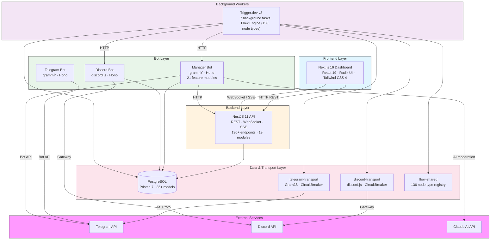
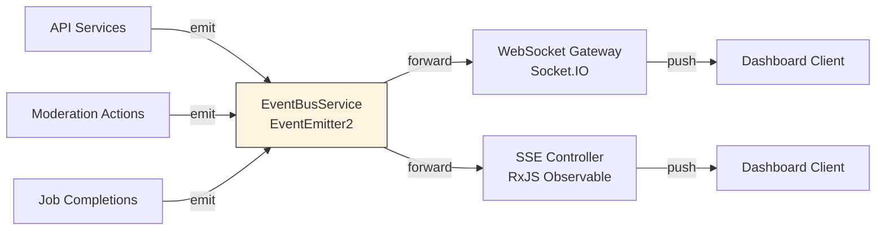
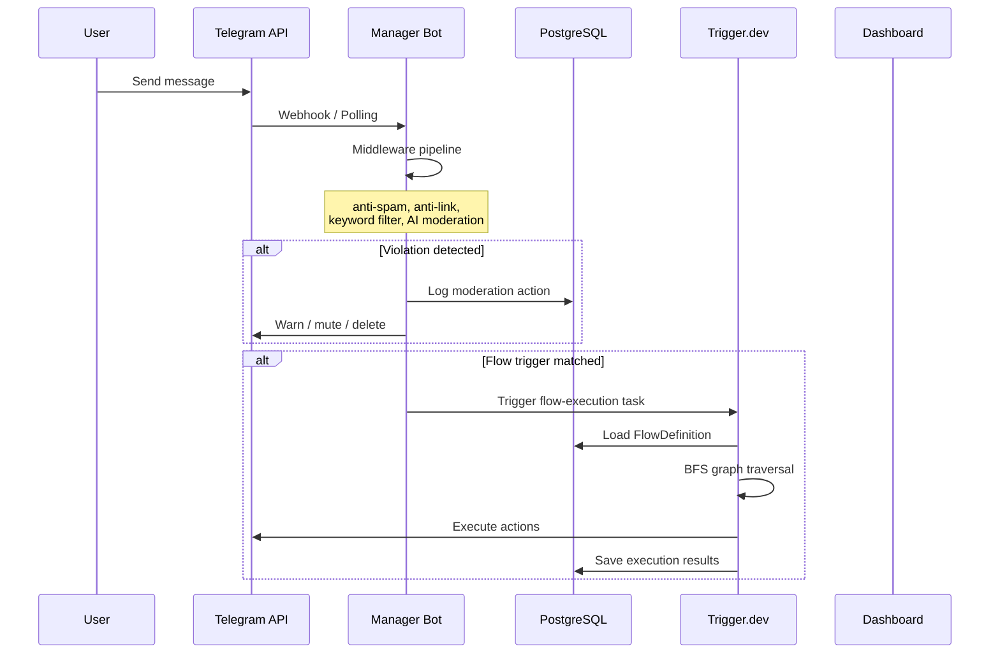
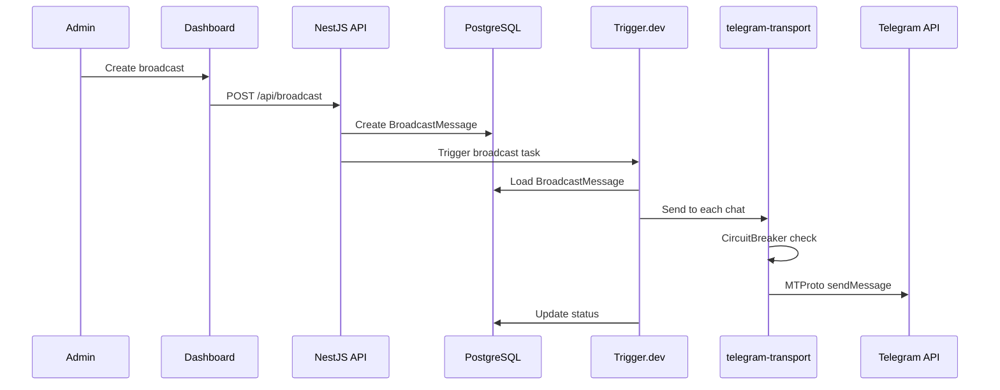
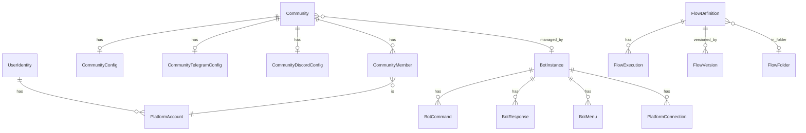
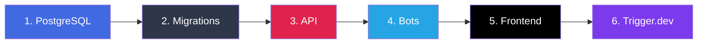

<p align="center">
  <h1 align="center">Flowbot</h1>
  <p align="center">
    Multi-platform bot management and visual flow automation platform
    <br />
    <strong>Telegram &middot; Discord &middot; Visual Flow Builder &middot; Real-Time Dashboard</strong>
  </p>
</p>

<p align="center">
  
  
  
  
  
  
</p>

---

## What is Flowbot?

Flowbot is an all-in-one platform for managing Telegram and Discord communities with a visual automation engine. It combines:

- **Visual Flow Builder** — drag-and-drop automation with 136 node types across Telegram, Discord, and cross-platform actions
- **Group Management Bot** — moderation, anti-spam, CAPTCHA, scheduling, reputation, AI content moderation
- **Admin Dashboard** — real-time monitoring, analytics, broadcast management, bot configuration
- **Background Job Engine** — reliable task execution with Trigger.dev for broadcasts, scheduled messages, flow execution

---

## Architecture

### System Overview



### Real-Time Event System



### Data Flow: Message Processing



### Data Flow: Broadcast Delivery



---

## Monorepo Structure

```
flowbot/
├── apps/
│   ├── bot/                  # Telegram bot (grammY)
│   ├── manager-bot/          # Group management bot (21 features)
│   ├── discord-bot/          # Discord bot
│   ├── api/                  # NestJS REST API + WebSocket + SSE
│   ├── frontend/             # Next.js admin dashboard (44 pages)
│   ├── trigger/              # Trigger.dev worker (7 tasks)
│   └── tg-client/            # MTProto auth script
├── packages/
│   ├── db/                   # Prisma 7 schema + client (35+ models)
│   ├── telegram-transport/   # GramJS MTProto + CircuitBreaker
│   ├── discord-transport/    # discord.js + CircuitBreaker
│   └── flow-shared/          # Node type registry (136 types)
├── scripts/                  # Migration scripts (6 data migration scripts)
├── docs/
│   ├── architecture.md       # Detailed architecture docs
│   └── superpowers/          # Design specs + implementation plans
├── docker-compose.yml        # PostgreSQL
└── tsconfig.base.json        # Shared TypeScript config
```

### Workspaces

| Workspace | Path | Stack |
|-----------|------|-------|
| Telegram Bot | `apps/bot` | grammY, Hono, Pino, Valibot |
| Manager Bot | `apps/manager-bot` | grammY, Hono, Pino, Valibot |
| Discord Bot | `apps/discord-bot` | discord.js, Hono, Pino |
| API | `apps/api` | NestJS 11, Swagger, class-validator |
| Frontend | `apps/frontend` | Next.js 16, React 19, Radix UI, Tailwind CSS 4 |
| Trigger Worker | `apps/trigger` | Trigger.dev v3 |
| TG Client | `apps/tg-client` | GramJS (telegram), tsx |
| DB | `packages/db` | Prisma 7, PostgreSQL |
| Telegram Transport | `packages/telegram-transport` | GramJS, CircuitBreaker |
| Discord Transport | `packages/discord-transport` | discord.js, CircuitBreaker |
| Flow Shared | `packages/flow-shared` | Node type registry (136 types) |

---

## Key Features

### Visual Flow Builder

The flow engine supports **136 node types** for building cross-platform automations:

```mermaid
graph LR
    subgraph Triggers["Triggers (23)"]
        T1["Telegram Events (14)"]
        T2["Discord Events (6)"]
        T3["General (3)
        schedule, webhook, custom_event"]
    end

    subgraph Conditions["Conditions (17)"]
        C1["Telegram (11)"]
        C2["Discord (5)"]
        C3["Context (1)"]
    end

    subgraph Actions["Actions (80+)"]
        A1["Telegram Messaging (22)"]
        A2["Telegram Management (9)"]
        A3["Discord (30)"]
        A4["Unified Cross-Platform (8)"]
        A5["Context & Utility (6)"]
    end

    subgraph Advanced["Advanced (7)"]
        X1["run_flow, emit_event"]
        X2["parallel_branch, loop"]
        X3["switch, transform, db_query"]
    end

    Triggers --> Conditions
    Conditions --> Actions
    Actions --> Advanced
    Advanced -->|"chain"| Triggers
```



Features:
- BFS graph traversal with LRU result caching
- Variable interpolation: `{{trigger.*}}`, `{{node.*}}`, `{{context.*}}`
- Persistent per-user context (`get_context` / `set_context`)
- Flow chaining with `run_flow` + `triggerAndWait` (max depth: 5)
- Cross-platform: Telegram trigger can feed Discord actions and vice versa
- Visual debugger with step-through execution timeline

### Manager Bot (21 Feature Modules)

| Feature | Description |
|---------|-------------|
| Moderation | `/warn`, `/mute`, `/ban`, `/kick` with escalation engine |
| Anti-Spam | Flood detection, duplicate filtering |
| Anti-Link | URL filtering with domain whitelist |
| CAPTCHA | Button/math challenges on join, timeout kick |
| Keyword Filters | Auto-delete + warn on keyword match |
| Welcome Messages | Configurable templates with variables |
| Scheduled Messages | `/schedule`, `/remind` with future delivery |
| Cross-Posting | Message syndication across groups |
| Rules System | `/rules`, `/setrules`, `/pinrules` |
| Media Restrictions | Per-group media type controls |
| Reputation | Score based on activity, tenure, warnings |
| AI Moderation | Claude-powered content classification |
| Analytics | In-memory counters, daily snapshots |
| Audit Logging | `/modlog` with full action history |

### Telegram User Account (MTProto Client)

Flowbot supports connecting real Telegram user accounts via MTProto protocol. Unlike bots, user accounts can:
- Access private groups and channels the user has joined
- Read full chat history and search messages
- Send messages without the "bot" badge
- Join/leave groups, create groups and channels
- Invite users by phone number or username

User account actions are available as purple "User Account Actions" in the flow builder node palette, and require an authenticated connection from the Connections page.

### Background Tasks (Trigger.dev)

| Task | Queue | Schedule | Description |
|------|-------|----------|-------------|
| `broadcast` | `telegram` | On-demand | Broadcast messages via MTProto |
| `cross-post` | `telegram` | On-demand | Syndicate messages across groups |
| `scheduled-message` | `telegram` | `* * * * *` | Deliver due messages every minute |
| `flow-execution` | `flows` | On-demand | Execute flow definitions (BFS engine) |
| `flow-event-cleanup` | default | `0 3 * * *` | Prune expired events daily |
| `analytics-snapshot` | default | `0 2 * * *` | Capture group analytics daily |
| `health-check` | default | `*/5 * * * *` | System health monitoring |

---

## Database Schema



**35+ models** across these domains:

| Domain | Models |
|--------|--------|
| Identity | `PlatformAccount`, `UserIdentity` |
| Communities | `Community`, `CommunityConfig`, `CommunityTelegramConfig`, `CommunityDiscordConfig`, `CommunityMember` |
| Connections | `PlatformConnection`, `PlatformConnectionLog` |
| Analytics | `CommunityAnalyticsSnapshot`, `ReputationScore` |
| Broadcast | `BroadcastMessage`, `CrossPostTemplate` |
| Moderation | `Warning`, `ModerationLog`, `ScheduledMessage` |
| Flow Engine | `FlowDefinition`, `FlowFolder`, `FlowExecution`, `FlowVersion`, `UserFlowContext`, `FlowEvent` |
| Bot Config | `BotInstance`, `BotCommand`, `BotResponse`, `BotMenu`, `BotMenuButton` |
| Webhooks | `WebhookEndpoint` |

---

## API Modules

| Module | Endpoints | Purpose |
|--------|-----------|---------|
| `auth` | `/api/auth/*` | Login, token verification |
| `platform` | _(global)_ | Platform strategy registry |
| `identity` | `/api/accounts/*`, `/api/identities/*` | Platform accounts, cross-platform identity linking |
| `communities` | `/api/communities/*` | Community CRUD, config, members, warnings, logs, scheduled messages |
| `connections` | `/api/connections/*` | Platform connections, auth flows, health |
| `broadcast` | `/api/broadcast/*` | Broadcast management (multi-platform) |
| `flows` | `/api/flows/*` | Flow CRUD, versioning, execution, analytics |
| `webhooks` | `/api/webhooks/*` | Webhook endpoints |
| `bot-config` | `/api/bot-config/*` | Bot instance configuration, heartbeat |
| `reputation` | `/api/reputation/*` | Account/identity/community reputation scores |
| `analytics` | `/api/analytics/*` | Community analytics snapshots |
| `automation` | `/api/automation/*` | Automation health and jobs |
| `system` | `/api/system/*` | Health checks |
| `events` | `/api/events/*` | WebSocket + SSE streams |

---

## Getting Started

### Prerequisites

- Node.js 20+
- pnpm 10+
- Docker (for PostgreSQL)

### Setup

```bash
pnpm install
docker compose up -d
pnpm db prisma:migrate
pnpm db generate
pnpm db build
```

### Development

```bash
pnpm api start:dev          # API on port 3000
pnpm bot dev                # Telegram bot
pnpm manager-bot dev        # Manager bot
pnpm discord-bot dev        # Discord bot
pnpm frontend dev           # Dashboard on port 3001
pnpm trigger dev            # Trigger.dev worker
```

### Testing

```bash
pnpm api test                           # Jest (238 tests)
pnpm manager-bot test                   # Vitest
pnpm telegram-transport test            # Vitest
pnpm trigger test                       # Vitest (264 tests)
pnpm tg-client test                     # Vitest
```

### Build

```bash
pnpm bot build
pnpm manager-bot build
pnpm api build
pnpm frontend build
```

---

## Environment Variables

| App | Required |
|-----|----------|
| Shared | `DATABASE_URL` |
| Bot | `BOT_TOKEN`, `BOT_MODE`, `BOT_ADMINS`, `LOG_LEVEL`, `SERVER_HOST`, `SERVER_PORT` |
| Manager Bot | `BOT_TOKEN`, `BOT_MODE`, `BOT_ADMINS`, `LOG_LEVEL`, `SERVER_HOST`, `SERVER_PORT`, `API_SERVER_HOST`, `API_SERVER_PORT` |
| Discord Bot | `DISCORD_BOT_TOKEN`, `DISCORD_CLIENT_ID`, `DATABASE_URL`, `API_URL`, `PORT` |
| Trigger | `DATABASE_URL`, `TG_CLIENT_API_ID`, `TG_CLIENT_API_HASH`, `TG_CLIENT_SESSION`, `MANAGER_BOT_API_URL` |
| API | `DATABASE_URL`, `PORT`, `FRONTEND_URL` |
| Frontend | `NEXT_PUBLIC_API_URL` |

Docker Compose: PostgreSQL on port 5432 (`postgres`/`postgres`/`flowbot_db`).

---

## Startup Order



```bash
docker compose up -d                    # 1. PostgreSQL
pnpm db prisma:migrate && pnpm db generate && pnpm db build  # 2. Migrations
pnpm api start:dev                      # 3. API
pnpm bot dev && pnpm manager-bot dev    # 4. Bots
pnpm frontend dev                       # 5. Frontend
pnpm trigger dev                        # 6. Trigger.dev
```

---

## Security

- **Authentication** — JWT bearer tokens via global `AuthGuard`, public routes use `@Public()` decorator
- **CORS** — restricted to `FRONTEND_URL`
- **Webhook Security** — unique auto-generated cuid tokens per endpoint
- **Flow Engine Safety** — `db_query` allowlisted queries only (max 100 records), `run_flow` max depth of 5, circular reference detection
- **Transport Resilience** — CircuitBreaker prevents cascading failures to Telegram/Discord APIs
- **AI Moderation** — Claude-powered content classification (spam, scam, toxic, off-topic)

---

## Tech Stack

| Layer | Technology |
|-------|-----------|
| Language | TypeScript (strict mode) |
| Monorepo | pnpm workspaces |
| Database | PostgreSQL + Prisma 7 |
| API | NestJS 11 |
| Frontend | Next.js 16 + React 19 |
| UI | Radix UI + Tailwind CSS 4 |
| Charts | Recharts |
| Flow Editor | React Flow (@xyflow/react) |
| Telegram Bots | grammY |
| Telegram MTProto | GramJS |
| Discord | discord.js |
| Background Jobs | Trigger.dev v3 |
| HTTP Servers | Hono (bots), Express (API) |
| Real-Time | Socket.IO + SSE |
| Validation | class-validator (API), Valibot (bots) |
| Logging | Pino |
| Testing | Jest, Vitest, Playwright |
| AI | Anthropic Claude API |

---

<p align="center">
  <sub>Built with TypeScript, powered by Trigger.dev</sub>
</p>
