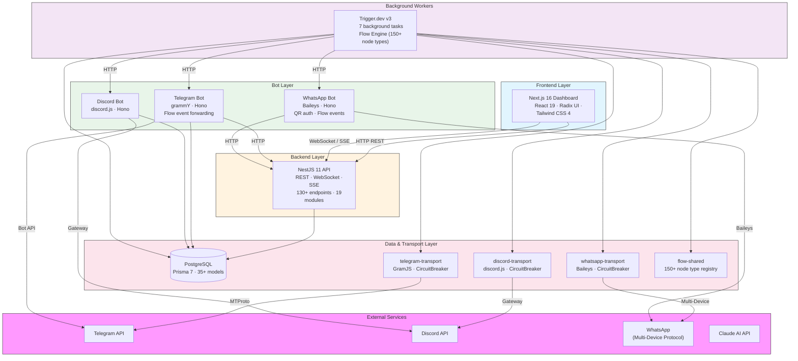
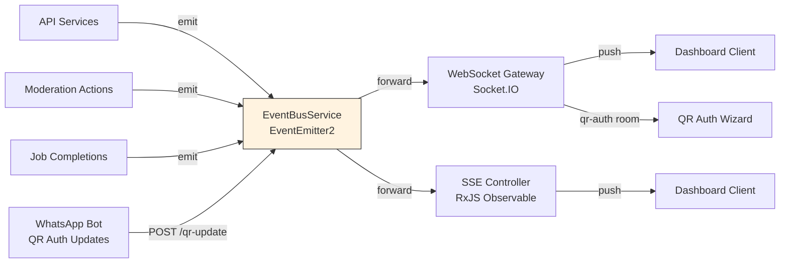
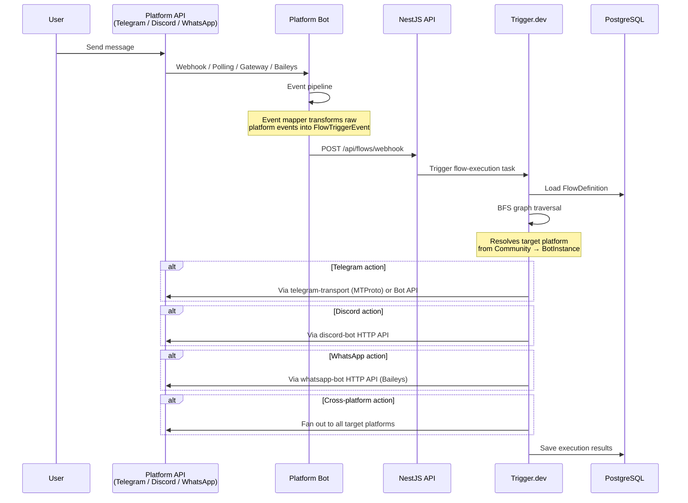
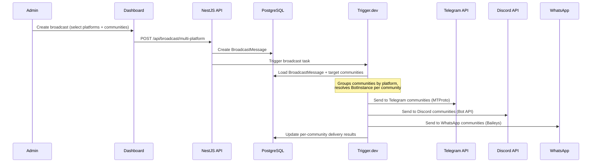
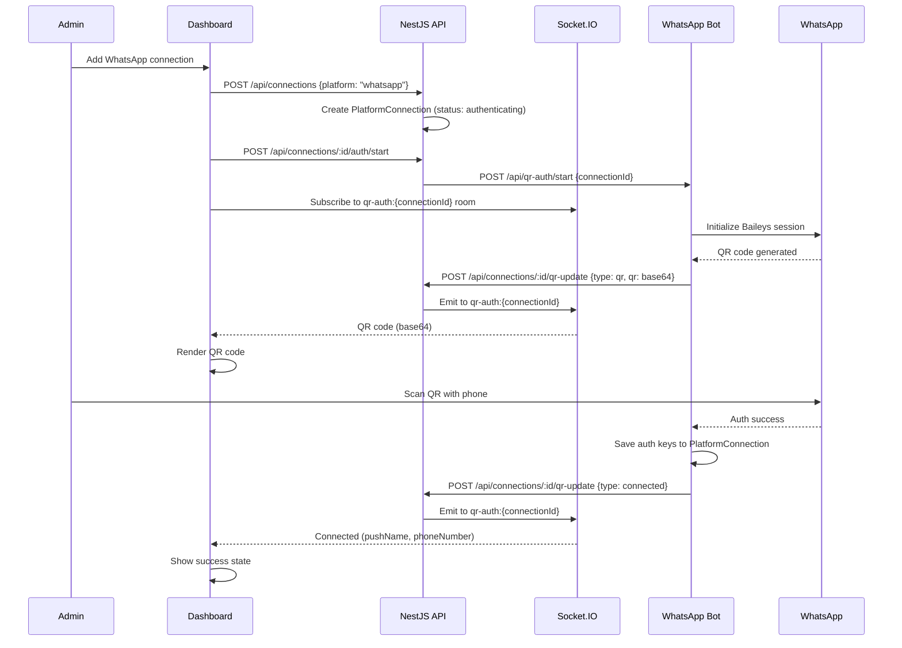
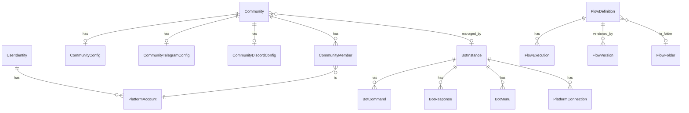

<p align="center">
  <h1 align="center">Flowbot</h1>
  <p align="center">
    Multi-platform bot management and visual flow automation platform
    <br />
    <strong>Telegram &middot; Discord &middot; WhatsApp &middot; Visual Flow Builder &middot; Real-Time Dashboard</strong>
  </p>
</p>

<p align="center">
  
  
  
  
  
  
</p>

---

## What is Flowbot?

Flowbot is an all-in-one platform for managing communities across **Telegram, Discord, WhatsApp, and more** with a visual automation engine. It combines:

- **Visual Flow Builder** — drag-and-drop automation with 150+ node types across Telegram, Discord, WhatsApp, and cross-platform actions
- **Multi-Platform Bots** — Telegram (grammY), Discord (discord.js), and WhatsApp (Baileys) bots that forward events to the flow engine for processing
- **Admin Dashboard** — real-time monitoring, analytics, multi-platform broadcast, community management, bot configuration
- **Background Job Engine** — reliable task execution with Trigger.dev for broadcasts, scheduled messages, flow execution
- **Telegram User Account** — MTProto client that acts as a real user for advanced operations bots can't do
- **WhatsApp User Account** — Baileys client with QR code auth, session persistence, group management, and full messaging

---

## Architecture

### System Overview



### Real-Time Event System



### Data Flow: Message Processing (Multi-Platform)



### Data Flow: Multi-Platform Broadcast



### Data Flow: WhatsApp QR Authentication



---

## Monorepo Structure

```
flowbot/
├── apps/
│   ├── telegram-bot/           # Telegram bot (Bot API) — receives events, executes bot actions
│   ├── discord-bot/            # Discord bot (Gateway) — receives events, executes bot actions
│   ├── whatsapp-bot/           # WhatsApp bot (Baileys) — QR auth, events, actions via user account
│   ├── api/                    # NestJS REST API + WebSocket + SSE
│   ├── frontend/               # Next.js admin dashboard (44 pages)
│   ├── trigger/                # Trigger.dev worker (7 tasks) + flow engine
│   └── tg-client/              # One-shot MTProto auth script (generates session strings)
├── packages/
│   ├── db/                     # Prisma 7 schema + client (35+ models)
│   ├── telegram-transport/     # GramJS MTProto SDK — user-account operations for flow engine
│   ├── discord-transport/      # discord.js transport SDK
│   ├── whatsapp-transport/     # Baileys WhatsApp SDK — messaging, groups, presence
│   └── flow-shared/            # Node type registry (150+ types)
├── scripts/                    # Data migration scripts
├── docs/
│   ├── architecture.md         # Detailed architecture docs
│   └── superpowers/            # Design specs + implementation plans
├── docker-compose.yml          # PostgreSQL
└── tsconfig.base.json          # Shared TypeScript config
```

### Workspaces

| Workspace | Path | Stack | Role |
|-----------|------|-------|------|
| Telegram Bot | `apps/telegram-bot` | grammY, Hono | Long-running bot — listens via Bot API, forwards events to flow engine |
| Discord Bot | `apps/discord-bot` | discord.js, Hono | Long-running bot — listens via Gateway, forwards events to flow engine |
| WhatsApp Bot | `apps/whatsapp-bot` | Baileys, Hono | Long-running bot — QR auth, listens via Baileys, forwards events to flow engine |
| API | `apps/api` | NestJS 11 | REST API, WebSocket, SSE — serves dashboard and coordinates all services |
| Frontend | `apps/frontend` | Next.js 16, React 19 | Admin dashboard — communities, flows, connections, broadcast, analytics |
| Trigger Worker | `apps/trigger` | Trigger.dev v3 | Background jobs + flow execution engine (BFS traversal, action dispatch) |
| TG Client | `apps/tg-client` | GramJS | One-shot auth script — generates MTProto session string per user account |
| DB | `packages/db` | Prisma 7 | Database schema + generated client (35+ models) |
| Telegram Transport | `packages/telegram-transport` | GramJS | MTProto SDK — user-account actions (read history, join groups, send as user) |
| Discord Transport | `packages/discord-transport` | discord.js | Transport SDK for Discord operations |
| WhatsApp Transport | `packages/whatsapp-transport` | Baileys | WhatsApp SDK — messaging, media, group admin, presence, session persistence |
| Flow Shared | `packages/flow-shared` | TypeScript | Node type registry (150+ types) shared between frontend and trigger |

### Telegram: Three Components

The platform has three distinct Telegram integrations serving different purposes:

| | `telegram-bot` | `telegram-transport` | `tg-client` |
|---|---|---|---|
| **What** | Bot process (long-running) | Library (SDK) | Auth script (one-shot) |
| **Protocol** | Bot API (grammY) | MTProto (GramJS) | MTProto (GramJS) |
| **Identity** | Bot account (has "bot" badge) | User account (real person) | User account (real person) |
| **Purpose** | Receive events + execute bot actions | Execute user-account flow actions | Generate session string for transport |

**How they connect:** `tg-client` authenticates a user account → session string stored in PlatformConnection → `telegram-transport` uses that session → Trigger.dev flow engine calls transport for user-account actions (read history, join groups, send without bot badge). Meanwhile, `telegram-bot` independently handles all bot-level operations and event forwarding.

### WhatsApp: Unified Bot + Transport

Unlike Telegram (which separates bot/user account roles), WhatsApp uses a single Baileys session that acts as both listener and executor:

| | `whatsapp-bot` | `whatsapp-transport` |
|---|---|---|
| **What** | Bot process (long-running) | Library (SDK) |
| **Protocol** | Baileys (WhatsApp multi-device) | Baileys (WhatsApp multi-device) |
| **Identity** | User account (phone number) | User account (phone number) |
| **Purpose** | Listen for events, forward to flow engine, execute actions via HTTP API | Transport interface, circuit breaker, action executors, DB-backed auth state |

**Auth flow:** User scans QR code on dashboard → Baileys auth keys stored in PlatformConnection → bot reconnects automatically on restart. No separate auth script needed (unlike Telegram's `tg-client`).

**Key capabilities:** Send/receive messages (text, media, documents), group management (kick, promote, demote), read message history, presence/status updates, broadcast to WhatsApp communities.

---

## Key Features

### Visual Flow Builder

The flow engine supports **170+ node types** for building cross-platform automations:

```mermaid
graph LR
    subgraph Triggers["Triggers (30+)"]
        T1["Telegram Events (14)"]
        T2["Discord Events (6)"]
        T3["WhatsApp Events (7)
        message, join, leave,
        promote, demote, group, presence"]
        T4["General (3)
        schedule, webhook, custom_event"]
    end

    subgraph Conditions["Conditions (17)"]
        C1["Telegram (11)"]
        C2["Discord (5)"]
        C3["Context (1)"]
    end

    subgraph Actions["Actions (120+)"]
        A1["Telegram Bot Actions (22)"]
        A2["Telegram User Account (18)"]
        A3["Discord (30)"]
        A4["WhatsApp (19)"]
        A5["Unified Cross-Platform (10)"]
        A6["Context & Utility (6)"]
    end

    subgraph Advanced["Advanced (7)"]
        X1["run_flow, emit_event"]
        X2["parallel_branch, loop"]
        X3["switch, transform, db_query"]
    end

    Triggers --> Conditions
    Conditions --> Actions
    Actions --> Advanced
    Advanced -->|"chain"| Triggers
```



Features:
- BFS graph traversal with LRU result caching
- Variable interpolation: `{{trigger.*}}`, `{{node.*}}`, `{{context.*}}`
- Persistent per-user context (`get_context` / `set_context`)
- Flow chaining with `run_flow` + `triggerAndWait` (max depth: 5)
- Cross-platform: Telegram trigger can feed Discord/WhatsApp actions and vice versa
- Visual debugger with step-through execution timeline

### Moderation & Automation

Moderation features (anti-spam, CAPTCHA, keyword filters, AI content moderation, etc.) are implemented as **visual flows** in the Flow Builder. Users create and customize moderation automations for any platform — Telegram, Discord, WhatsApp, or all three — without writing code.

### Telegram User Account (MTProto Client)

Flowbot supports connecting real Telegram user accounts via MTProto protocol. Unlike bots, user accounts can:
- Access private groups and channels the user has joined
- Read full chat history and search messages
- Send messages without the "bot" badge
- Join/leave groups, create groups and channels
- Invite users by phone number or username

User account actions are available as purple "User Account Actions" in the flow builder node palette, and require an authenticated connection from the Connections page.

### WhatsApp Integration (Baileys)

Flowbot connects to WhatsApp via the unofficial Baileys multi-device protocol, enabling:
- Send/receive text, media, documents, locations, contacts, and stickers
- Group management — kick, promote, demote participants; get group metadata and invite links
- Read message history and manage messages (edit, delete, forward)
- Presence and status updates
- Broadcast to WhatsApp communities via the multi-platform broadcast system
- Dashboard QR code auth — scan with your phone, session auto-persists in the database

WhatsApp actions are available in the flow builder and can be triggered by WhatsApp events (messages, member joins/leaves) or cross-platform unified actions.

### Background Tasks (Trigger.dev)

| Task | Queue | Schedule | Description |
|------|-------|----------|-------------|
| `broadcast` | default | On-demand | Multi-platform broadcast to target communities |
| `cross-post` | default | On-demand | Syndicate messages across communities and platforms |
| `scheduled-message` | default | `* * * * *` | Deliver due messages every minute |
| `flow-execution` | `flows` | On-demand | Execute flow definitions (BFS engine) |
| `flow-event-cleanup` | default | `0 3 * * *` | Prune expired events daily |
| `analytics-snapshot` | default | `0 2 * * *` | Capture community analytics daily |
| `health-check` | default | `*/5 * * * *` | System health monitoring |

---

## Database Schema



**35+ models** across these domains:

| Domain | Models |
|--------|--------|
| Identity | `PlatformAccount`, `UserIdentity` |
| Communities | `Community`, `CommunityConfig`, `CommunityTelegramConfig`, `CommunityDiscordConfig`, `CommunityMember` |
| Connections | `PlatformConnection`, `PlatformConnectionLog` |
| Analytics | `CommunityAnalyticsSnapshot`, `ReputationScore` |
| Broadcast | `BroadcastMessage`, `CrossPostTemplate` |
| Moderation | `Warning`, `ModerationLog`, `ScheduledMessage` |
| Flow Engine | `FlowDefinition`, `FlowFolder`, `FlowExecution`, `FlowVersion`, `UserFlowContext`, `FlowEvent` |
| Bot Config | `BotInstance`, `BotCommand`, `BotResponse`, `BotMenu`, `BotMenuButton` |
| Webhooks | `WebhookEndpoint` |

---

## API Modules

| Module | Endpoints | Purpose |
|--------|-----------|---------|
| `auth` | `/api/auth/*` | Login, token verification |
| `platform` | _(global)_ | Platform strategy registry |
| `identity` | `/api/accounts/*`, `/api/identities/*` | Platform accounts, cross-platform identity linking |
| `communities` | `/api/communities/*` | Community CRUD, config, members, warnings, logs, scheduled messages |
| `connections` | `/api/connections/*` | Platform connections, auth flows, health |
| `broadcast` | `/api/broadcast/*` | Broadcast management (multi-platform) |
| `flows` | `/api/flows/*` | Flow CRUD, versioning, execution, analytics |
| `webhooks` | `/api/webhooks/*` | Webhook endpoints |
| `bot-config` | `/api/bot-config/*` | Bot instance configuration, heartbeat |
| `reputation` | `/api/reputation/*` | Account/identity/community reputation scores |
| `analytics` | `/api/analytics/*` | Community analytics snapshots |
| `automation` | `/api/automation/*` | Automation health and jobs |
| `system` | `/api/system/*` | Health checks |
| `events` | `/api/events/*` | WebSocket + SSE streams |

---

## Getting Started

### Prerequisites

- Node.js 20+
- pnpm 10+
- Docker (for PostgreSQL)

### Setup

```bash
pnpm install
docker compose up -d
pnpm db prisma:migrate
pnpm db generate
pnpm db build
```

### Development

```bash
pnpm api start:dev          # API on port 3000
pnpm telegram-bot dev       # Telegram bot
pnpm discord-bot dev        # Discord bot
pnpm whatsapp-bot dev       # WhatsApp bot on port 3004
pnpm frontend dev           # Dashboard on port 3001
pnpm trigger dev            # Trigger.dev worker
```

### Testing

```bash
pnpm api test                           # Jest (238 tests)
pnpm telegram-bot test                  # Vitest
pnpm telegram-transport test            # Vitest
pnpm whatsapp-transport test            # Vitest (52 tests)
pnpm whatsapp-bot test                  # Vitest (44 tests)
pnpm trigger test                       # Vitest (264 tests)
pnpm tg-client test                     # Vitest
```

### Build

```bash
pnpm telegram-bot build
pnpm api build
pnpm frontend build
```

---

## Environment Variables

| App | Required |
|-----|----------|
| Shared | `DATABASE_URL` |
| Telegram Bot | `BOT_TOKEN`, `BOT_MODE`, `BOT_ADMINS`, `LOG_LEVEL`, `SERVER_HOST`, `SERVER_PORT`, `API_SERVER_HOST`, `API_SERVER_PORT` |
| Discord Bot | `DISCORD_BOT_TOKEN`, `DISCORD_CLIENT_ID`, `DATABASE_URL`, `API_URL`, `PORT` |
| WhatsApp Bot | `WA_CONNECTION_ID`, `WA_BOT_INSTANCE_ID`, `DATABASE_URL`, `API_URL`, `SERVER_PORT` (default 3004) |
| Trigger | `DATABASE_URL`, `TG_CLIENT_API_ID`, `TG_CLIENT_API_HASH`, `TG_CLIENT_SESSION`, `TELEGRAM_BOT_API_URL` |
| API | `DATABASE_URL`, `PORT`, `FRONTEND_URL` |
| Frontend | `NEXT_PUBLIC_API_URL` |

Docker Compose: PostgreSQL on port 5432 (`postgres`/`postgres`/`flowbot_db`).

---

## Startup Order


```bash
docker compose up -d                    # 1. PostgreSQL
pnpm db prisma:migrate && pnpm db generate && pnpm db build  # 2. Migrations
pnpm api start:dev                      # 3. API
pnpm telegram-bot dev                   # 4. Bots
pnpm whatsapp-bot dev                   # 4. Bots (WhatsApp)
pnpm frontend dev                       # 5. Frontend
pnpm trigger dev                        # 6. Trigger.dev
```

---

## Security

- **Authentication** — JWT bearer tokens via global `AuthGuard`, public routes use `@Public()` decorator
- **CORS** — restricted to `FRONTEND_URL`
- **Webhook Security** — unique auto-generated cuid tokens per endpoint
- **Flow Engine Safety** — `db_query` allowlisted queries only (max 100 records), `run_flow` max depth of 5, circular reference detection
- **Transport Resilience** — CircuitBreaker prevents cascading failures to Telegram/Discord/WhatsApp APIs
- **AI Moderation** — Claude-powered content classification (spam, scam, toxic, off-topic)

---

## Tech Stack

| Layer | Technology |
|-------|-----------|
| Language | TypeScript (strict mode) |
| Monorepo | pnpm workspaces |
| Database | PostgreSQL + Prisma 7 |
| API | NestJS 11 |
| Frontend | Next.js 16 + React 19 |
| UI | Radix UI + Tailwind CSS 4 |
| Charts | Recharts |
| Flow Editor | React Flow (@xyflow/react) |
| Telegram Bots | grammY |
| Telegram MTProto | GramJS |
| Discord | discord.js |
| WhatsApp | Baileys (@whiskeysockets/baileys) |
| Background Jobs | Trigger.dev v3 |
| HTTP Servers | Hono (bots), Express (API) |
| Real-Time | Socket.IO + SSE |
| Validation | class-validator (API), Valibot (bots) |
| Logging | Pino |
| Testing | Jest, Vitest, Playwright |
| AI | Anthropic Claude API |

---

<p align="center">
  <sub>Built with TypeScript, powered by Trigger.dev</sub>
</p>
