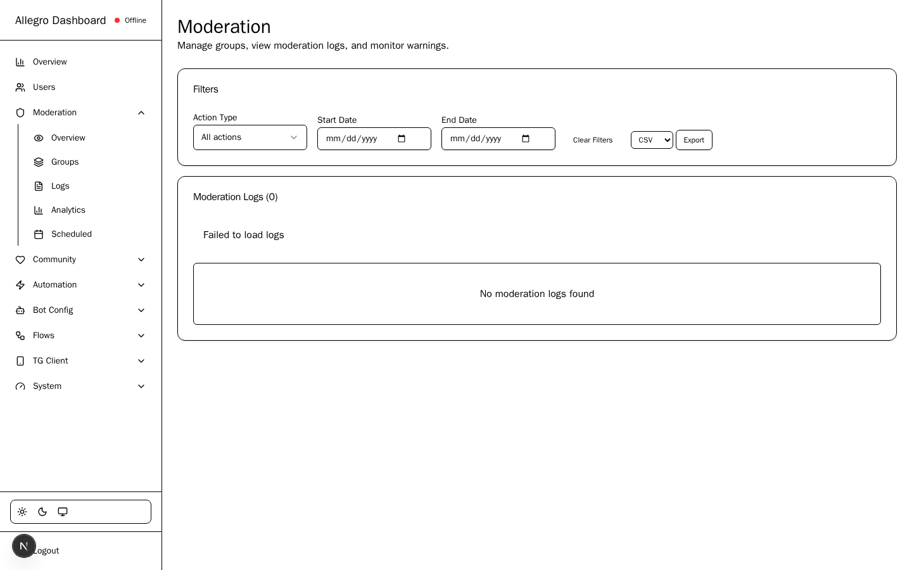
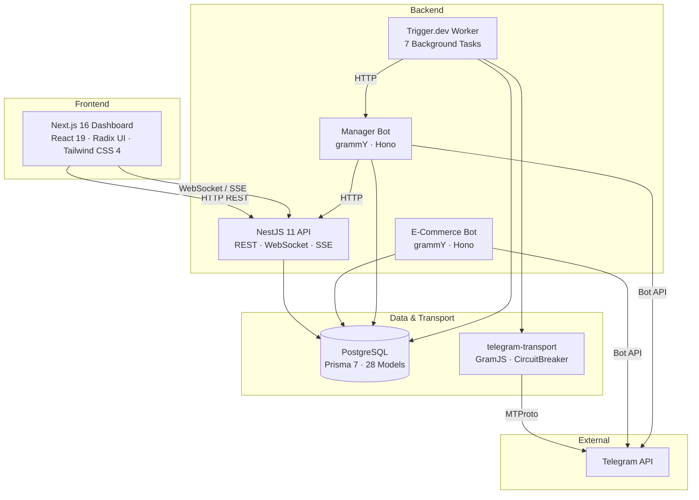
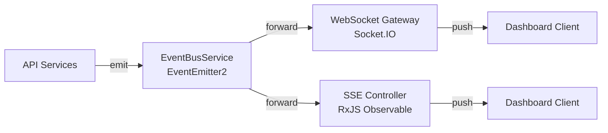
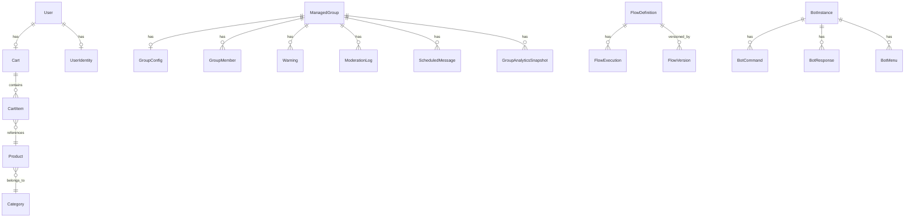
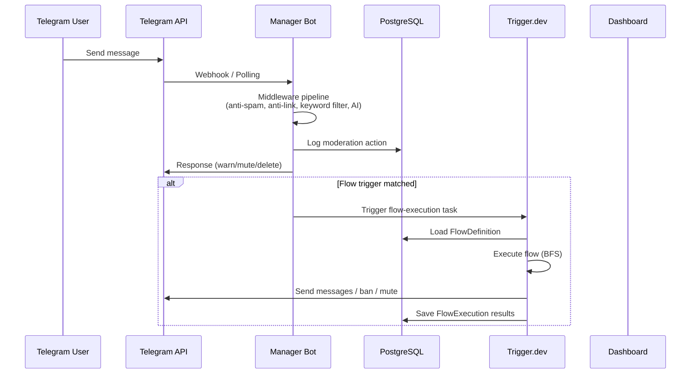
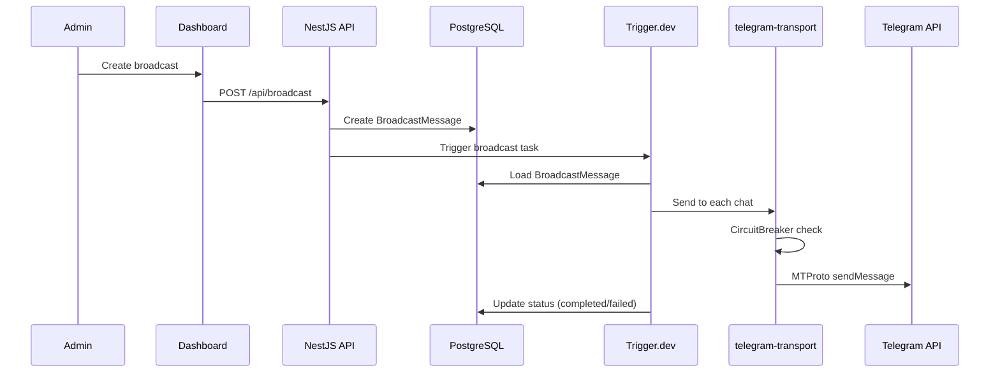

# Strefa Ruchu

Telegram e-commerce and group management platform. pnpm monorepo with 8 workspaces, 28 Prisma models, 80+ API endpoints, 35+ dashboard pages, and 7 Trigger.dev background tasks.

---

## Screenshots

### Login


### Dashboard Overview


### Users Management


### Broadcast Composer


### Flow Builder


### Moderation Logs


### Bot Config


### Webhooks


> All screenshots are available in [`docs/screenshots/`](docs/screenshots/).

---

## System Architecture



---

## Workspaces

| Workspace | Path | Stack | Module |
|-----------|------|-------|--------|
| **Bot** | `apps/bot` | grammY, Hono, Pino, Valibot | ESM (tsx) |
| **Manager Bot** | `apps/manager-bot` | grammY, Hono, Pino, Valibot | ESM (tsx) |
| **API** | `apps/api` | NestJS 11, Swagger, class-validator | CommonJS |
| **Frontend** | `apps/frontend` | Next.js 16, Radix UI, Tailwind CSS 4 | ESM |
| **Trigger** | `apps/trigger` | Trigger.dev v3 | ESM |
| **DB** | `packages/db` | Prisma 7, PostgreSQL | — |
| **telegram-transport** | `packages/telegram-transport` | GramJS, CircuitBreaker, ActionRunner | ESM |
| **tg-client** | `apps/tg-client` | _DEPRECATED_ — MTProto auth script only | ESM |

---

## Apps

### Bot (`apps/bot`)

E-commerce Telegram bot for product browsing, shopping cart, and order management.

**Stack:** grammY + Hono HTTP server (ESM via tsx)

**Features:**
- Product catalog browsing with inline keyboards
- Shopping cart management (add, remove, update quantities)
- User profile and language preferences
- Admin commands for store management
- i18n support (locales in `locales/`)

**Architecture:**

```
apps/bot/src/
├── bot/
│   ├── features/        # Command handlers (admin, products, profile, welcome, menu)
│   ├── keyboards/       # Inline and reply keyboard builders
│   ├── callback-data/   # Callback query parsers
│   ├── middlewares/      # Session, auth, rate limiting
│   ├── filters/          # Custom grammY filter queries
│   └── context.ts       # Extended grammY context type
├── locales/             # i18n translation files
├── server/              # Hono HTTP server (webhook + health)
└── main.ts              # Entrypoint (polling or webhook via BOT_MODE)
```

**Runtime modes:** Polling (`BOT_MODE=polling` for dev) or Webhook (`BOT_MODE=webhook` for prod).

---

### Manager Bot (`apps/manager-bot`)

Group management bot with moderation, anti-spam, CAPTCHA, scheduling, and AI content moderation.

**Stack:** grammY + Hono HTTP server (ESM via tsx)

**Features:**
- **Moderation:** `/warn`, `/mute`, `/ban`, `/kick`, `/unwarn`, `/unban` with escalation engine
- **Anti-Spam:** Flood detection, duplicate filtering, configurable thresholds
- **Anti-Link:** URL filtering with domain whitelist
- **CAPTCHA Verification:** Button/math challenges on join, timeout → kick
- **Keyword Filters:** Auto-delete + warn on keyword match
- **Welcome Messages:** Configurable templates with variables
- **Scheduled Messages:** `/schedule`, `/remind` with future delivery
- **Cross-Posting:** Message syndication across multiple groups
- **Rules System:** `/rules`, `/setrules`, `/pinrules`
- **Media Restrictions:** Granular per-group media type controls
- **Product Promotion:** `/promote <slug>`, `/featured` for e-commerce integration
- **Pipeline:** Automated member → customer conversion with welcome DMs
- **Reputation System:** Score calculation based on activity, tenure, warnings
- **AI Moderation:** Claude-powered content classification (spam, scam, toxic, off-topic)
- **Analytics:** In-memory counters, `/stats` commands, daily snapshots
- **Audit Logging:** `/modlog` with full action history

**Architecture:**

```
apps/manager-bot/src/
├── bot/
│   ├── features/        # 21 feature modules (moderation, anti-spam, captcha, etc.)
│   ├── middlewares/      # Group context, permissions, rate limiting
│   ├── handlers/         # Error handler
│   └── helpers/          # Permissions, deeplinks, time parsing, logging
├── repositories/        # Data access layer (Group, Member, Warning, ModerationLog)
├── services/            # Business logic (anti-spam, analytics, reputation, AI, scheduler)
├── server/              # Hono server with POST /api/send-message endpoint
└── main.ts              # Entrypoint (polling/webhook, graceful shutdown)
```

**Key integration point:** The Hono server exposes `POST /api/send-message` used by Trigger.dev tasks and the flow engine to send messages through the bot.

---

### API (`apps/api`)

REST API server with WebSocket and SSE real-time support.

**Stack:** NestJS 11 (CommonJS) with Swagger, class-validator, Socket.IO

**Features:**
- 80+ REST endpoints across 15+ modules
- JWT authentication with global AuthGuard
- Swagger/OpenAPI documentation
- WebSocket gateway (Socket.IO) for real-time events
- Server-Sent Events (SSE) fallback
- EventBus for internal event distribution

**API Modules:**

| Module | Endpoints | Purpose |
|--------|-----------|---------|
| `auth` | `/api/auth/*` | Login, token verification |
| `users` | `/api/users/*` | User CRUD, unified profiles |
| `products` | `/api/products/*` | Product CRUD |
| `categories` | `/api/categories/*` | Category tree CRUD |
| `cart` | `/api/cart/*` | Shopping cart operations |
| `broadcast` | `/api/broadcast/*` | Broadcast management + Trigger.dev dispatch |
| `flows` | `/api/flows/*` | Flow CRUD, versioning, execution, analytics, webhooks |
| `webhooks` | `/api/webhooks/*` | Webhook endpoint management |
| `bot-config` | `/api/bot-config/*` | Bot instance configuration (commands, responses, menus) |
| `moderation` | `/api/moderation/*` | Groups, members, warnings, logs, crosspost, scheduled messages |
| `analytics` | `/api/analytics/*` | Group analytics snapshots, time series |
| `reputation` | `/api/reputation/*` | User reputation scores + breakdown |
| `automation` | `/api/automation/*` | Automation rules and jobs |
| `system` | `/api/system/*` | Health checks, system status |
| `tg-client` | `/api/tg-client/*` | Telegram client session management, auth flow |
| `events` | `/api/events/*` | SSE stream endpoint |

**Real-Time Architecture:**



Event categories: `moderation` (warnings, bans, mutes), `automation` (broadcasts, jobs), `system` (health updates).

---

### Frontend (`apps/frontend`)

Admin dashboard with visual flow builder, real-time updates, and comprehensive management UI.

**Stack:** Next.js 16 + React 19 + Radix UI + Tailwind CSS 4 (ESM)

**Features:**
- **Dashboard Overview:** Stat cards, activity feed, mini charts
- **Flow Builder:** Visual drag-and-drop editor (React Flow) with node palette, property editor, execution visualization
- **Moderation:** Group management, member actions, warning viewer, audit log
- **Analytics:** Member growth charts, moderation activity, spam trends (Recharts)
- **Bot Config:** Command editor, response editor, menu builder with Telegram preview
- **Broadcasts:** Composer with group selector, delivery status tracking
- **Scheduled Messages:** Create, list, cancel with calendar UI
- **TG Client:** Session management, auth wizard, transport health dashboard
- **Webhooks:** Endpoint management, payload viewer, flow connection
- **Users:** Unified cross-app profiles with sales history, group memberships, reputation
- **Dark Mode:** Light/dark/system with CSS variables, no FOUC
- **Real-Time:** WebSocket + SSE for live moderation feed, job progress, health status
- **Responsive:** Mobile-first with table→card layout breakpoints

**Architecture:**

```
apps/frontend/src/
├── app/
│   ├── dashboard/
│   │   ├── page.tsx              # Overview with stats
│   │   ├── flows/                # Flow builder + list + editor
│   │   ├── moderation/           # Groups, logs, analytics, warnings
│   │   ├── broadcast/            # Broadcast composer + list
│   │   ├── bot-config/           # Bot instance configuration
│   │   ├── tg-client/            # Telegram client management
│   │   ├── users/                # User profiles
│   │   ├── products/             # Product management
│   │   ├── categories/           # Category tree
│   │   ├── webhooks/             # Webhook endpoints
│   │   ├── automation/           # Automation health + rules
│   │   └── ...                   # 35+ pages total
│   └── layout.tsx                # Root layout with theme + sidebar
├── components/
│   ├── ui/                       # Radix UI primitives (30+ components)
│   ├── flow-builder/             # React Flow nodes, edges, palette
│   └── ...                       # Feature-specific components
├── lib/
│   ├── api.ts                    # Centralized fetch wrapper with auth
│   └── websocket.tsx             # Socket.IO client context
└── hooks/                        # useWebSocket, useRealtimeQuery, etc.
```

---

### Trigger.dev Worker (`apps/trigger`)

Background job processor running 7 tasks on a self-hosted Trigger.dev instance.

**Stack:** Trigger.dev v3 (ESM)

**Tasks:**

| Task | Queue | Schedule | Description |
|------|-------|----------|-------------|
| `broadcast` | `telegram` | On-demand | Sends broadcast messages to multiple chats via GramJS |
| `order-notification` | `telegram` | On-demand | Sends social-proof order notifications to groups |
| `cross-post` | `telegram` | On-demand | Syndicates messages across multiple groups |
| `scheduled-message` | `telegram` | `* * * * *` | Delivers due scheduled messages every minute |
| `flow-execution` | `flows` | On-demand | Executes flow definitions via the BFS engine |
| `analytics-snapshot` | default | `0 2 * * *` | Captures daily group analytics at 2 AM |
| `health-check` | default | `*/5 * * * *` | System health monitoring every 5 minutes |

**Architecture:**

```
apps/trigger/src/
├── trigger/                  # Task definitions
│   ├── broadcast.ts
│   ├── order-notification.ts
│   ├── cross-post.ts
│   ├── scheduled-message.ts
│   ├── flow-execution.ts
│   ├── analytics-snapshot.ts
│   └── health-check.ts
├── lib/
│   ├── prisma.ts             # Lazy singleton via getPrisma()
│   ├── telegram.ts           # GramJS transport with CircuitBreaker
│   ├── manager-bot.ts        # HTTP client for manager bot API
│   ├── event-correlator.ts   # Cross-bot context enrichment
│   └── flow-engine/          # Complete flow execution engine
│       ├── executor.ts       # BFS graph walker
│       ├── variables.ts      # {{template}} interpolation
│       ├── conditions.ts     # Condition evaluators
│       ├── actions.ts        # Action executors
│       ├── advanced-nodes.ts # Loop, parallel, switch, transform, db_query
│       └── templates.ts      # Built-in flow templates
└── trigger.config.ts
```

**Flow Engine:** The flow execution engine performs BFS traversal of node graphs, supporting 17 node types including triggers, conditions, actions, loops, parallel branches, switches, transforms, and database queries. Variables flow between nodes via `{{template.interpolation}}` syntax.

---

## Packages

### DB (`packages/db`)

Shared Prisma 7 schema and client for PostgreSQL.

**28 Models across 7 domains:**



| Domain | Models |
|--------|--------|
| E-commerce | `User`, `Category`, `Product`, `Cart`, `CartItem` |
| Group Management | `ManagedGroup`, `GroupConfig`, `GroupMember`, `Warning`, `ModerationLog`, `ScheduledMessage` |
| Analytics | `GroupAnalyticsSnapshot`, `ReputationScore` |
| Cross-App | `UserIdentity`, `CrossPostTemplate`, `BroadcastMessage`, `OrderEvent` |
| TG Client | `ClientSession`, `ClientLog` |
| Flow Engine | `FlowDefinition`, `FlowExecution`, `FlowVersion` |
| Bot Config | `BotInstance`, `BotCommand`, `BotResponse`, `BotMenu`, `BotMenuButton` |
| Webhooks | `WebhookEndpoint` |

**Path aliases:** `@tg-allegro/db` → `packages/db/src/index.ts`

---

### telegram-transport (`packages/telegram-transport`)

GramJS-based Telegram MTProto client with reliability features.

**Components:**
- **GramJsTransport** — MTProto client implementing `ITelegramTransport` interface
- **CircuitBreaker** — Prevents cascading failures (CLOSED → OPEN after 5 failures/60s → HALF-OPEN probe after 30s)
- **ActionRunner** — Queues and executes operations with retry, backoff, and idempotency
- **Executors** — Broadcast, cross-post, send-message, order-notification, forward-message
- **FakeTelegramTransport** — Test double for unit tests

**Used by:** Trigger.dev tasks for all Telegram message delivery that requires MTProto (broadcast, cross-post, scheduled messages, order notifications).

---

## Data Flow

### Message Processing



### Broadcast Delivery



---

## Getting Started

### Prerequisites

- Node.js 20+
- pnpm 9+
- Docker (for PostgreSQL)

### Setup

```bash
# Install dependencies
pnpm install

# Start PostgreSQL
docker compose up -d

# Run migrations and generate Prisma client
pnpm db prisma:migrate
pnpm db generate
pnpm db build
```

### Development

```bash
# Start individual services
pnpm api start:dev          # API on port 3000
pnpm bot dev                # E-commerce bot
pnpm manager-bot dev        # Manager bot
pnpm frontend dev           # Dashboard on port 3001
pnpm trigger dev            # Trigger.dev worker
```

### Build

```bash
pnpm bot build
pnpm manager-bot build
pnpm api build
pnpm frontend build
```

### Testing

```bash
# Unit tests
pnpm api test                           # Jest (235 tests)
pnpm manager-bot test                   # Vitest (99 tests)
pnpm telegram-transport test            # Vitest (24 tests)
pnpm trigger test                       # Vitest (106 tests)

# E2E tests
pnpm frontend test:e2e                  # Playwright (80+ tests)

# Specific test
pnpm api test -- --testPathPattern=users
```

### Typecheck

```bash
pnpm manager-bot typecheck
pnpm trigger typecheck
pnpm telegram-transport typecheck
```

---

## Environment Variables

| App | Required |
|-----|----------|
| Shared | `DATABASE_URL` |
| Bot | `BOT_TOKEN`, `BOT_MODE`, `BOT_ADMINS`, `LOG_LEVEL`, `SERVER_HOST`, `SERVER_PORT` |
| Manager Bot | `BOT_TOKEN`, `BOT_MODE`, `BOT_ADMINS`, `LOG_LEVEL`, `SERVER_HOST`, `SERVER_PORT`, `API_SERVER_HOST`, `API_SERVER_PORT` |
| Trigger | `DATABASE_URL`, `TG_CLIENT_API_ID`, `TG_CLIENT_API_HASH`, `TG_CLIENT_SESSION`, `MANAGER_BOT_API_URL` |
| API | `DATABASE_URL`, `PORT`, `FRONTEND_URL` |
| Frontend | `NEXT_PUBLIC_API_URL` |

Docker Compose: PostgreSQL on port 5432 (`postgres`/`postgres`/`strefaruchu_db`).

---

## Startup Order

1. PostgreSQL (`docker compose up -d`)
2. Migrations (`pnpm db prisma:migrate && pnpm db generate && pnpm db build`)
3. API (`pnpm api start:dev`)
4. Bots (`pnpm bot dev`, `pnpm manager-bot dev`)
5. Frontend (`pnpm frontend dev`)
6. Trigger.dev worker (`pnpm trigger dev`)

---

## Project Structure

```
tg-allegro/
├── apps/
│   ├── bot/                  # E-commerce Telegram bot
│   ├── manager-bot/          # Group management Telegram bot
│   ├── api/                  # NestJS REST API + WebSocket + SSE
│   ├── frontend/             # Next.js admin dashboard
│   ├── trigger/              # Trigger.dev background worker
│   └── tg-client/            # DEPRECATED — MTProto auth script only
├── packages/
│   ├── db/                   # Prisma 7 schema + client
│   └── telegram-transport/   # GramJS client with CircuitBreaker
├── docs/
│   ├── architecture.md       # Detailed architecture documentation
│   ├── flow-builder.md       # Flow builder user guide
│   └── plans/                # Design documents
├── docker-compose.yml        # PostgreSQL
├── tsconfig.base.json        # Shared TypeScript config + path aliases
└── package.json              # Workspace scripts
```

---

## Security

- **Authentication:** JWT bearer tokens via global `AuthGuard`. Public routes use `@Public()` decorator.
- **CORS:** Restricted to `FRONTEND_URL`.
- **Webhook Security:** Unique auto-generated tokens (cuid) per endpoint.
- **Flow Engine Safety:** `db_query` node uses allowlist of permitted Prisma queries, max 100 records.
- **Transport Resilience:** CircuitBreaker prevents cascading failures to Telegram API.

---

## Tech Stack

| Layer | Technology |
|-------|-----------|
| Language | TypeScript (strict mode) |
| Monorepo | pnpm workspaces |
| Database | PostgreSQL + Prisma 7 |
| API | NestJS 11 |
| Frontend | Next.js 16 + React 19 |
| UI Components | Radix UI + Tailwind CSS 4 |
| Charts | Recharts |
| Flow Editor | React Flow (@xyflow/react) |
| Telegram Bots | grammY |
| Telegram MTProto | GramJS |
| Background Jobs | Trigger.dev v3 |
| HTTP Servers | Hono (bots), Express (API) |
| Real-Time | Socket.IO + SSE |
| Validation | class-validator (API), Valibot (bots) |
| Logging | Pino |
| Testing | Jest, Vitest, Playwright |
| AI | Anthropic Claude API |
