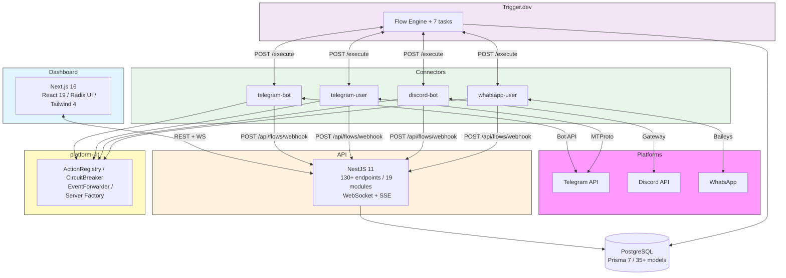
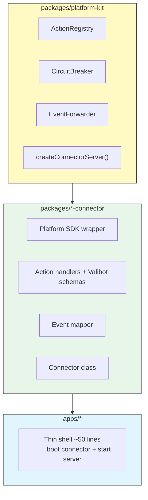
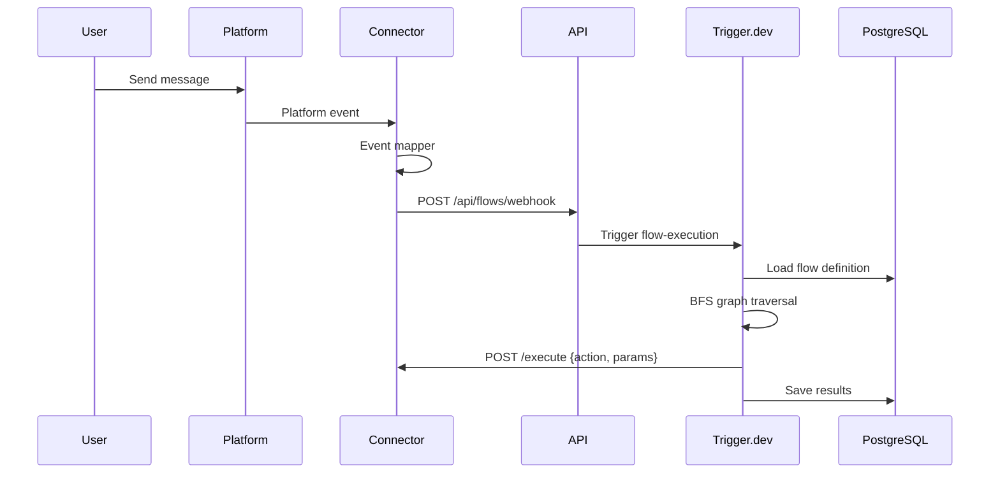
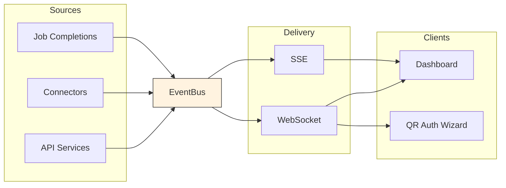
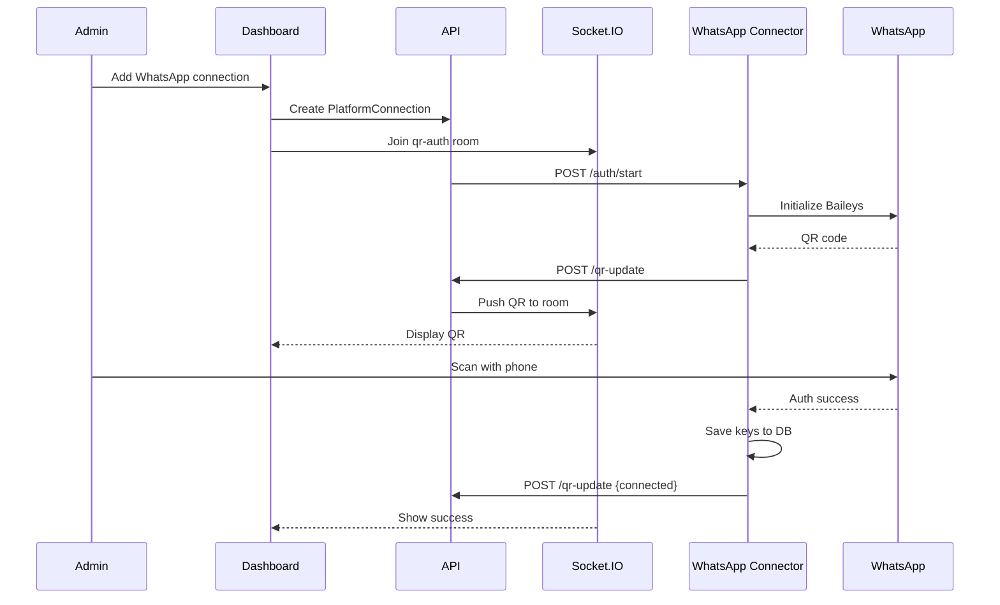
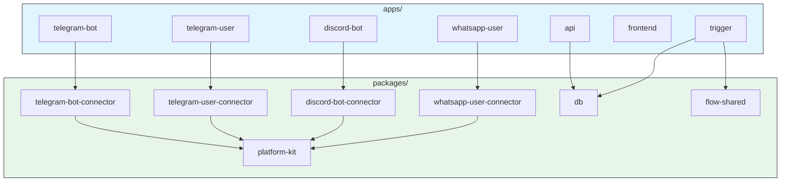
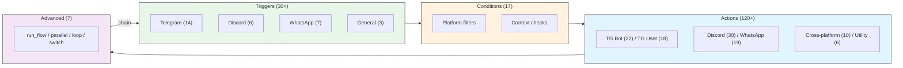
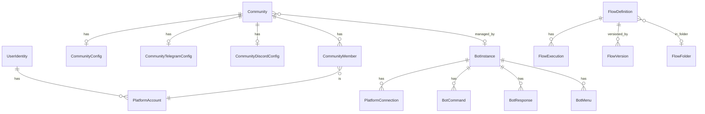

<p align="center">
  <h1 align="center">Flowbot</h1>
  <p align="center">
    Multi-platform bot management and visual flow automation platform
    <br />
    <strong>Telegram &middot; Discord &middot; WhatsApp &middot; Visual Flow Builder &middot; Real-Time Dashboard</strong>
  </p>
</p>

<p align="center">
  
  
  
  
  
  
  
</p>

---

## What is Flowbot?

Flowbot is an all-in-one platform for managing communities across **Telegram, Discord, and WhatsApp** with a visual automation engine.

- **Visual Flow Builder** — 170+ node types, drag-and-drop automation across all platforms
- **Unified Connector Architecture** — every platform uses the same pattern, same HTTP contract, same testing approach
- **Admin Dashboard** — real-time monitoring, analytics, broadcast, community management
- **Background Jobs** — Trigger.dev for broadcasts, scheduled messages, flow execution
- **User Account Support** — Telegram MTProto and WhatsApp Baileys for operations bots can't do

---

## Architecture

### System Overview



### Connector Pattern

Every platform connector follows the same three-layer architecture:



Every connector exposes the same HTTP contract:

| Endpoint | Purpose |
|----------|---------|
| `POST /execute` | `{ action, params }` &rarr; `{ success, data?, error? }` |
| `GET /health` | `{ status, uptime, connected }` |
| `GET /actions` | List of registered actions with schemas |

The dispatcher is platform-agnostic — it resolves a community's connector URL and sends `{ action, params }`. No platform-specific routing.

### Platform Matrix

Each platform is split by **identity** (bot vs user account):

|  | Bot Account | User Account |
|---|---|---|
| **Telegram** | `telegram-bot-connector` (grammY) | `telegram-user-connector` (GramJS) |
| **Discord** | `discord-bot-connector` (discord.js) | _(future)_ |
| **WhatsApp** | _(n/a)_ | `whatsapp-user-connector` (Baileys) |

### Message Processing



### Real-Time Events



### WhatsApp QR Authentication



---

## Monorepo Structure



### Workspaces

| Workspace | Stack | Tests | Role |
|-----------|-------|-------|------|
| `apps/telegram-bot` | Thin shell | — | Boots telegram-bot-connector |
| `apps/telegram-user` | Thin shell | — | Boots telegram-user-connector |
| `apps/discord-bot` | Thin shell | — | Boots discord-bot-connector |
| `apps/whatsapp-user` | Thin shell | — | Boots whatsapp-user-connector |
| `apps/api` | NestJS 11 | 238 | REST API + WebSocket + SSE |
| `apps/frontend` | Next.js 16, React 19 | Playwright | Admin dashboard (44 pages) |
| `apps/trigger` | Trigger.dev v3 | Vitest | Flow engine + 7 background tasks |
| `packages/platform-kit` | Hono, Valibot | 29 | ActionRegistry, CircuitBreaker, EventForwarder |
| `packages/telegram-bot-connector` | grammY, Valibot | 75 | Bot API actions, events, features |
| `packages/telegram-user-connector` | GramJS, Valibot | 95 | MTProto user-account actions |
| `packages/discord-bot-connector` | discord.js, Valibot | 116 | Gateway actions, events, features |
| `packages/whatsapp-user-connector` | Baileys, Valibot | 86 | Multi-device actions, events, QR auth |
| `packages/db` | Prisma 7 | — | Schema + client (35+ models) |
| `packages/flow-shared` | TypeScript | — | 150+ node type registry |

---

## Visual Flow Builder

170+ node types for cross-platform automations:



- BFS graph traversal with LRU result caching
- Variable interpolation: `{{trigger.*}}`, `{{node.*}}`, `{{context.*}}`
- Flow chaining with `run_flow` + `triggerAndWait` (max depth: 5)
- Cross-platform: any trigger can feed any platform's actions
- Visual debugger with step-through execution timeline

---

## Database



| Domain | Models |
|--------|--------|
| Identity | `PlatformAccount`, `UserIdentity` |
| Communities | `Community`, `CommunityConfig`, `CommunityTelegramConfig`, `CommunityDiscordConfig`, `CommunityMember` |
| Connections | `PlatformConnection`, `PlatformConnectionLog` |
| Analytics | `CommunityAnalyticsSnapshot`, `ReputationScore` |
| Broadcast | `BroadcastMessage`, `CrossPostTemplate` |
| Moderation | `Warning`, `ModerationLog`, `ScheduledMessage` |
| Flow Engine | `FlowDefinition`, `FlowFolder`, `FlowExecution`, `FlowVersion`, `UserFlowContext`, `FlowEvent` |
| Bot Config | `BotInstance`, `BotCommand`, `BotResponse`, `BotMenu`, `BotMenuButton` |
| Webhooks | `WebhookEndpoint` |

---

## API

| Module | Endpoints | Purpose |
|--------|-----------|---------|
| `auth` | `/api/auth/*` | JWT login, token verification |
| `identity` | `/api/accounts/*`, `/api/identities/*` | Platform accounts, cross-platform linking |
| `communities` | `/api/communities/*` | CRUD, config, members, warnings, logs |
| `connections` | `/api/connections/*` | Platform connections, auth flows |
| `broadcast` | `/api/broadcast/*` | Multi-platform broadcast |
| `flows` | `/api/flows/*` | Flow CRUD, versioning, execution |
| `webhooks` | `/api/webhooks/*` | Webhook endpoints |
| `bot-config` | `/api/bot-config/*` | Bot instances, heartbeat |
| `reputation` | `/api/reputation/*` | Reputation scores |
| `analytics` | `/api/analytics/*` | Community analytics |
| `events` | `/api/events/*` | WebSocket + SSE streams |

---

## Background Tasks

| Task | Schedule | Description |
|------|----------|-------------|
| `flow-execution` | On-demand | Execute flow definitions (BFS engine) |
| `broadcast` | On-demand | Multi-platform broadcast to communities |
| `cross-post` | On-demand | Syndicate messages across platforms |
| `scheduled-message` | Every minute | Deliver due messages |
| `flow-event-cleanup` | Daily 3 AM | Prune expired events |
| `analytics-snapshot` | Daily 2 AM | Capture community analytics |
| `health-check` | Every 5 min | System health monitoring |

---

## Getting Started

### Prerequisites

- Node.js 20+
- pnpm 10+
- Docker (for PostgreSQL)

### Setup

```bash
pnpm install
docker compose up -d
pnpm db prisma:migrate
pnpm db generate && pnpm db build
```

### Development

```bash
pnpm api start:dev          # API on :3000
pnpm telegram-bot dev       # Telegram bot connector
pnpm telegram-user dev      # Telegram user connector
pnpm discord-bot dev        # Discord bot connector
pnpm whatsapp-user dev      # WhatsApp connector on :3004
pnpm frontend dev           # Dashboard on :3001
pnpm trigger dev            # Trigger.dev worker
```

### Testing

```bash
pnpm api test                        # 238 tests (Jest)
pnpm platform-kit test               # 29 tests (Vitest)
pnpm telegram-bot-connector test     # 75 tests
pnpm telegram-user-connector test    # 95 tests
pnpm discord-bot-connector test      # 116 tests
pnpm whatsapp-user-connector test    # 86 tests
pnpm trigger test                    # Vitest
```

### Startup Order


---

## Environment Variables

| App | Required |
|-----|----------|
| Shared | `DATABASE_URL` |
| Telegram Bot | `BOT_TOKEN`, `BOT_MODE`, `BOT_ADMINS`, `SERVER_HOST`, `SERVER_PORT` |
| Telegram User | `TG_SESSION_STRING`, `TG_API_ID`, `TG_API_HASH` |
| Discord Bot | `DISCORD_BOT_TOKEN`, `DISCORD_BOT_INSTANCE_ID`, `API_URL` |
| WhatsApp User | `WA_CONNECTION_ID`, `WA_BOT_INSTANCE_ID`, `DATABASE_URL`, `API_URL` |
| Trigger | `DATABASE_URL`, `TG_CLIENT_API_ID`, `TG_CLIENT_API_HASH`, `TG_CLIENT_SESSION` |
| API | `DATABASE_URL`, `PORT`, `FRONTEND_URL` |
| Frontend | `NEXT_PUBLIC_API_URL` |

---

## Security

- **Auth** — JWT bearer tokens, `@Public()` decorator for open routes
- **CORS** — restricted to `FRONTEND_URL`
- **Input Validation** — Valibot schemas on every connector action, class-validator on API
- **CircuitBreaker** — generic breaker in platform-kit prevents cascading failures
- **Flow Safety** — `db_query` allowlist, `run_flow` max depth 5, circular reference detection
- **Webhook Security** — unique auto-generated cuid tokens per endpoint

---

## Tech Stack

| Layer | Technology |
|-------|-----------|
| Language | TypeScript (strict mode) |
| Monorepo | pnpm workspaces |
| Database | PostgreSQL + Prisma 7 |
| API | NestJS 11 |
| Frontend | Next.js 16 + React 19 + Radix UI + Tailwind 4 |
| Flow Editor | React Flow (@xyflow/react) |
| Connectors | platform-kit + Hono + Valibot |
| Telegram | grammY (bot) + GramJS (user) |
| Discord | discord.js |
| WhatsApp | Baileys |
| Background Jobs | Trigger.dev v3 |
| Real-Time | Socket.IO + SSE |
| Testing | Jest + Vitest + Playwright |
| Logging | Pino |

---

<p align="center">
  <sub>Built with TypeScript, powered by Trigger.dev</sub>
</p>
