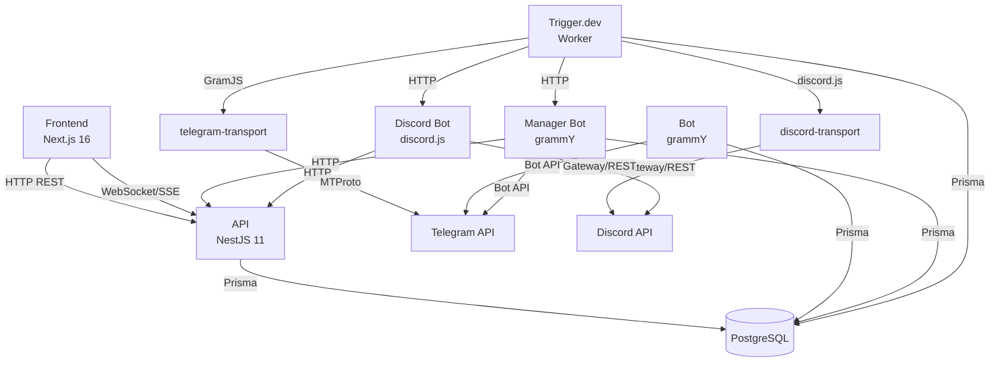
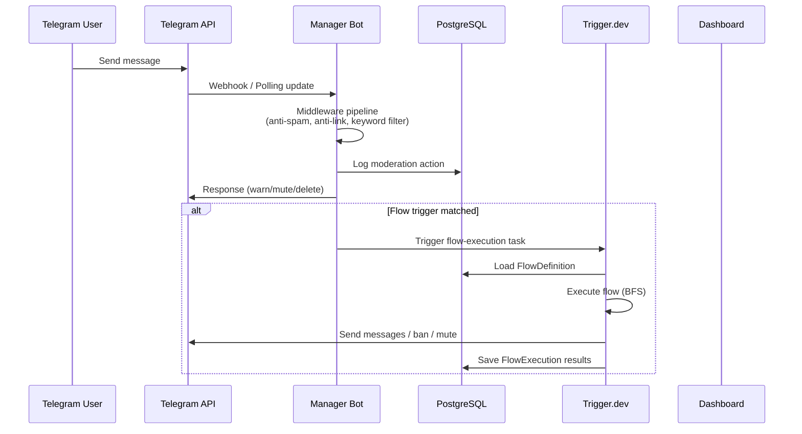
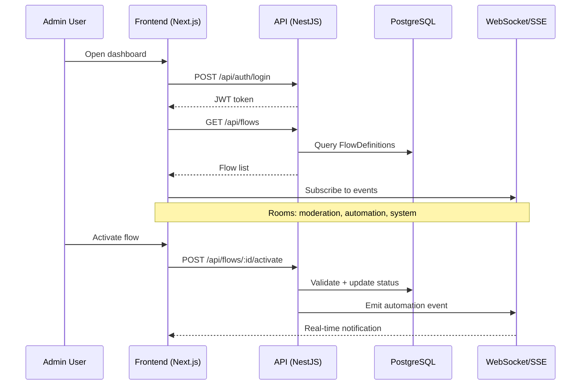
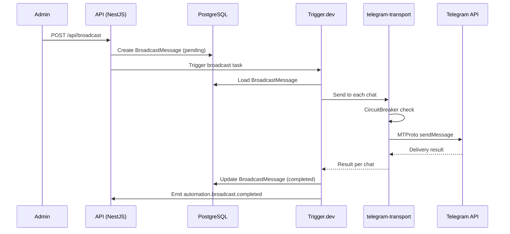
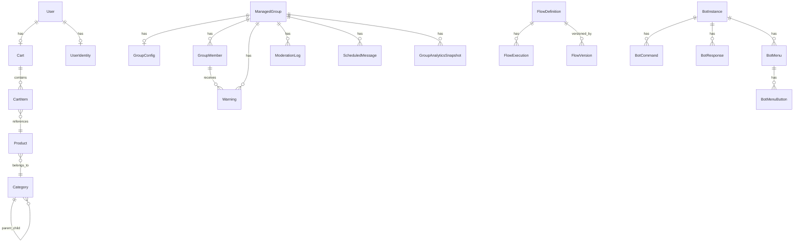
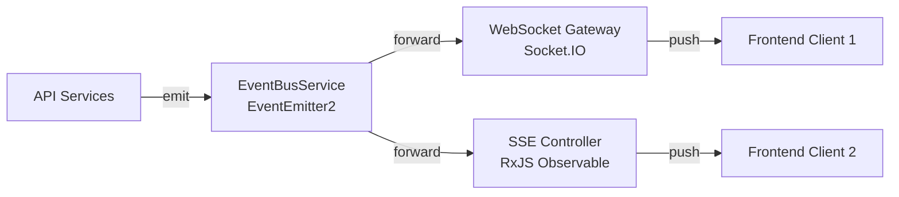

# Architecture

## System Overview

Strefa Ruchu is a multi-platform e-commerce and group management platform built as a pnpm monorepo with 10 workspaces. It supports both Telegram and Discord as messaging platforms.

```
tg-allegro/
├── apps/
│   ├── bot/              # E-commerce Telegram bot (grammY, Hono)
│   ├── manager-bot/      # Group management Telegram bot (grammY, Hono)
│   ├── discord-bot/      # Discord bot (discord.js, Hono)
│   ├── api/              # REST API + WebSocket server (NestJS 11)
│   ├── frontend/         # Admin dashboard (Next.js 16, Radix UI)
│   ├── trigger/          # Background job worker (Trigger.dev v3)
│   └── tg-client/        # DEPRECATED - MTProto auth script only
├── packages/
│   ├── db/               # Prisma 7 schema + client (PostgreSQL)
│   ├── telegram-transport/ # GramJS client with CircuitBreaker
│   └── discord-transport/  # discord.js transport with CircuitBreaker
├── docker-compose.yml    # PostgreSQL
└── tsconfig.base.json    # Shared TypeScript config + path aliases
```

### Workspace Relationships



All workspaces share the `@tg-allegro/db` package for database access. TypeScript path aliases (`@tg-allegro/*`) are defined in `tsconfig.base.json`.

### Multi-Platform Flow Architecture

Flows can span both Telegram and Discord. The flow engine is platform-agnostic: trigger data is stored as a generic `Record<string, unknown>` and template variables are resolved dynamically via `{{trigger.*}}` syntax. This means a Discord trigger (e.g., `discord_message_received`) can feed data into Telegram actions (e.g., `send_message`) and vice versa.

The dispatcher (`dispatcher.ts`) routes actions to the correct platform based on the action name prefix:
- Actions prefixed with `discord_` are dispatched to the Discord bot's HTTP API.
- All other actions are dispatched via Telegram (MTProto or Bot API, depending on transport configuration).

Cross-platform flow example:
1. A `discord_message_received` trigger fires in a Discord channel.
2. A `keyword_match` condition checks `{{trigger.content}}` for keywords.
3. A `send_message` action sends a notification to a Telegram chat using `{{trigger.content}}`.

---

## Data Flow Diagrams

### User Message Processing



### Dashboard Interaction



### Broadcast Delivery



---

## Component Architecture

### Bot (`apps/bot`)

The e-commerce bot built with grammY and Hono.

- **Runtime:** ESM via tsx
- **Modes:** Polling (dev, `BOT_MODE=polling`) or Webhook (prod, `BOT_MODE=webhook`)
- **Structure:**
  - `bot/features/` -- command and conversation handlers
  - `bot/keyboards/` -- inline and reply keyboard builders
  - `bot/callback-data/` -- callback query parsers
  - `bot/middlewares/` -- session, auth, rate limiting
  - `bot/filters/` -- custom grammY filter queries
  - `bot/context.ts` -- extended grammY context type
  - `locales/` -- i18n translation files
- **Server:** Hono HTTP server for webhook endpoint and health checks

### Manager Bot (`apps/manager-bot`)

The group management bot with moderation, anti-spam, CAPTCHA, and scheduling.

- **Runtime:** ESM via tsx
- **Structure mirrors bot:**
  - `bot/features/` -- moderation, anti-spam, CAPTCHA, schedule, crosspost, keyword filters, quarantine, pipeline
  - `bot/middlewares/` -- group context, permissions, rate limiting
  - `repositories/` -- data access layer
  - `services/` -- business logic
  - `server/` -- Hono server with `/api/send-message` endpoint (called by Trigger.dev and flow engine)

### API (`apps/api`)

NestJS 11 REST API with Swagger documentation, WebSocket, and SSE.

- **Runtime:** CommonJS
- **Module System:** 15+ feature modules:

| Module | Endpoints | Purpose |
|--------|-----------|---------|
| `auth` | `/api/auth/*` | Login, token verification |
| `users` | `/api/users/*` | User CRUD |
| `products` | `/api/products/*` | Product CRUD |
| `categories` | `/api/categories/*` | Category CRUD |
| `cart` | `/api/cart/*` | Shopping cart |
| `broadcast` | `/api/broadcast/*` | Broadcast management |
| `flows` | `/api/flows/*` | Flow CRUD, versioning, execution, analytics |
| `webhooks` | `/api/webhooks/*` | Webhook endpoint management |
| `bot-config` | `/api/bot-config/*` | Bot instance configuration |
| `moderation` | `/api/moderation/*` | Groups, members, warnings, logs, crosspost, scheduled messages |
| `analytics` | `/api/analytics/*` | Group analytics snapshots |
| `reputation` | `/api/reputation/*` | User reputation scores |
| `automation` | `/api/automation/*` | Automation rules |
| `system` | `/api/system/*` | Health checks, system status |
| `tg-client` | `/api/tg-client/*` | Telegram client session management |
| `events` | `/api/events/*` | SSE stream endpoint |

- **Auth:** Global `AuthGuard` (Bearer JWT). Public routes decorated with `@Public()`.
- **Patterns:** Services use `constructor(private prisma: PrismaService)` with DTO mapping.

### Frontend (`apps/frontend`)

Next.js 16 admin dashboard with React 19 and Radix UI.

- **Runtime:** ESM
- **Router:** App Router (`app/` directory)
- **Dashboard pages:** 35+ pages under `app/dashboard/`
  - Flow builder with visual editor
  - Expression builder component for complex conditions
  - Moderation logs, analytics, user management
  - Bot configuration, webhook management
  - Broadcast management, scheduled messages
- **Styling:** Tailwind CSS 4 with class-based dark mode
- **API Client:** `lib/api.ts` -- centralized fetch wrapper with auth headers
- **Real-time:** `lib/websocket.tsx` -- Socket.IO client for live updates
- **UI Components:** Radix UI primitives in `components/ui/`

### Trigger.dev (`apps/trigger`)

Background job worker running Trigger.dev v3, self-hosted at `trigger.raqz.link`.

- **Tasks (7 total):**

| Task | Queue | Description |
|------|-------|-------------|
| `broadcast` | `telegram` | Sends broadcast messages to multiple chats |
| `order-notification` | `telegram` | Sends order event notifications |
| `cross-post` | `telegram` | Cross-posts messages between groups |
| `scheduled-message` | `telegram` | Sends scheduled messages at specified times |
| `flow-execution` | `flows` (concurrency: 5) | Executes flow definitions via the flow engine |
| `analytics-snapshot` | default | Captures daily group analytics |
| `health-check` | default | Periodic system health monitoring |

- **Shared libraries:**
  - `lib/prisma.ts` -- lazy singleton Prisma client via `getPrisma()`
  - `lib/telegram.ts` -- telegram-transport integration
  - `lib/manager-bot.ts` -- HTTP client for manager bot API
  - `lib/flow-engine/` -- complete flow execution engine (executor, variables, conditions, actions, advanced nodes, templates)
  - `lib/event-correlator.ts` -- enriches trigger data with cross-bot context

### Discord Bot (`apps/discord-bot`)

The Discord bot built with discord.js and Hono.

- **Runtime:** ESM via tsx
- **Gateway intents:** Guilds, GuildMessages, GuildMembers, GuildMessageReactions, GuildVoiceStates, MessageContent, GuildScheduledEvents
- **Structure:**
  - `bot/index.ts` -- creates and configures the discord.js `Client`
  - `bot/events/` -- event handlers for messages, member join/leave, reactions, interactions, voice state
  - `services/flow-events.ts` -- `DiscordFlowEventForwarder` normalizes Discord events and POSTs them to the flow engine webhook
  - `server/` -- Hono HTTP server with `/api/execute-action` endpoint (called by Trigger.dev dispatcher)
  - `config.ts` -- environment configuration
- **Flow integration:** Discord events are forwarded to the flow engine webhook as trigger data with `platform: 'discord'`. The forwarder tags all events with `platform` and `timestamp` fields.
- **Environment:** `DISCORD_BOT_TOKEN`, `DISCORD_CLIENT_ID`, `DATABASE_URL`, `API_URL`, `PORT`

### telegram-transport (`packages/telegram-transport`)

GramJS-based Telegram MTProto client with reliability features.

- **CircuitBreaker:** Prevents cascading failures when Telegram API is down.
- **ActionRunner:** Queues and executes Telegram operations with rate limiting.
- **Used by:** Trigger.dev tasks for broadcast, cross-post, and scheduled message delivery.

### discord-transport (`packages/discord-transport`)

discord.js-based transport layer with reliability features, mirroring the telegram-transport architecture.

- **Interface:** `IDiscordTransport` defines all supported Discord operations (messaging, moderation, channels, threads, roles, invites, scheduled events).
- **Implementations:**
  - `DiscordJsTransport` -- production implementation using discord.js
  - `FakeDiscordTransport` -- in-memory mock for testing
- **CircuitBreaker:** Same pattern as telegram-transport to prevent cascading failures.
- **Used by:** Trigger.dev flow engine dispatcher for Discord action execution.

---

## Database Design

The database uses PostgreSQL with Prisma 7 ORM. The schema contains 28 models across 7 domains.

### Domain Model Overview



### Key Models

| Domain | Models | Purpose |
|--------|--------|---------|
| E-commerce | `User`, `Category`, `Product`, `Cart`, `CartItem` | Product catalog, shopping cart, user profiles |
| Group Management | `ManagedGroup`, `GroupConfig`, `GroupMember`, `Warning`, `ModerationLog`, `ScheduledMessage` | Group settings, members, moderation actions |
| Analytics | `GroupAnalyticsSnapshot`, `ReputationScore` | Daily metrics, user reputation scoring |
| Cross-App | `UserIdentity`, `CrossPostTemplate`, `BroadcastMessage`, `OrderEvent` | Identity linking, message distribution |
| TG Client | `ClientSession`, `ClientLog` | MTProto session management |
| Flow Engine | `FlowDefinition`, `FlowExecution`, `FlowVersion` | Flow storage, execution history, versioning |
| Bot Config | `BotInstance`, `BotCommand`, `BotResponse`, `BotMenu`, `BotMenuButton` | Dynamic bot configuration |
| Webhooks | `WebhookEndpoint` | Inbound webhook registration |

### Indexing Strategy

All models use strategic indexes for query performance:
- Foreign keys are indexed for join queries.
- Status/boolean fields indexed for filtered listings (e.g., `isActive`, `isBanned`).
- Timestamp fields indexed for date-range queries (e.g., `createdAt`, `lastSeenAt`).
- Composite indexes for common filter combinations (e.g., `[groupId, isActive]`, `[status, createdAt]`).

---

## Deployment

### Docker Compose

The project uses Docker Compose for the PostgreSQL database:

```yaml
services:
  postgres:
    image: postgres:18-alpine
    environment:
      POSTGRES_USER: postgres
      POSTGRES_PASSWORD: postgres
      POSTGRES_DB: strefaruchu_db
    ports:
      - '5432:5432'
    healthcheck:
      test: ['CMD-SHELL', 'pg_isready -U postgres']
      interval: 5s
      timeout: 5s
      retries: 5
```

Application services run directly via their respective dev/build commands.

### Environment Variables

| App | Required Variables |
|-----|-------------------|
| Shared | `DATABASE_URL` |
| Bot | `BOT_TOKEN`, `BOT_MODE`, `BOT_ADMINS`, `LOG_LEVEL`, `SERVER_HOST`, `SERVER_PORT` |
| Manager Bot | `BOT_TOKEN`, `BOT_MODE`, `BOT_ADMINS`, `LOG_LEVEL`, `SERVER_HOST`, `SERVER_PORT`, `API_SERVER_HOST`, `API_SERVER_PORT` |
| Discord Bot | `DISCORD_BOT_TOKEN`, `DISCORD_CLIENT_ID`, `DATABASE_URL`, `API_URL`, `PORT` |
| Trigger | `DATABASE_URL`, `TG_CLIENT_API_ID`, `TG_CLIENT_API_HASH`, `TG_CLIENT_SESSION`, `MANAGER_BOT_API_URL` |
| API | `DATABASE_URL`, `PORT`, `FRONTEND_URL` |
| Frontend | `NEXT_PUBLIC_API_URL` |

### Health Checks

- **PostgreSQL:** `pg_isready` via Docker healthcheck.
- **API:** `/api/system/health` endpoint.
- **Trigger.dev:** `health-check` task runs periodically.
- **Bots:** Hono servers expose health endpoints.

### Startup Order

1. Start PostgreSQL (`docker compose up -d`)
2. Run migrations (`pnpm db prisma:migrate`)
3. Generate Prisma client (`pnpm db generate && pnpm db build`)
4. Start API (`pnpm api start:dev`)
5. Start Telegram bots (`pnpm bot dev`, `pnpm manager-bot dev`)
6. Start Discord bot (`pnpm discord-bot dev`)
7. Start frontend (`pnpm frontend dev`)
8. Start Trigger.dev worker (`pnpm trigger dev`)

---

## Security

### Authentication

The API uses password-based authentication with JWT bearer tokens.

- **Login:** `POST /api/auth/login` returns a JWT token.
- **Global guard:** `AuthGuard` is applied to all routes by default (via `APP_GUARD`).
- **Public routes:** Decorated with `@Public()` to bypass the auth guard.
- **Token verification:** The `Authorization: Bearer <token>` header is checked on every request.

### CORS

The API configures CORS to allow requests from the frontend URL (`FRONTEND_URL` env var). The WebSocket gateway similarly restricts origins.

### Webhook Security

Webhook endpoints use unique, auto-generated tokens (`cuid`). Inbound webhook requests must include the correct token to trigger a flow.

### Database Query Safety

The flow engine's `db_query` node uses an allowlist of permitted queries to prevent arbitrary database access:
- `user.count`, `user.findMany`
- `product.count`, `product.findMany`
- `broadcastMessage.count`

Query results are limited to a maximum of 100 records per request.

---

## Real-Time System

The platform provides real-time updates to the dashboard via two transport mechanisms.

### Architecture



### Event Types

| Category | Events | Data |
|----------|--------|------|
| Moderation | `warning.created`, `warning.deactivated`, `member.banned`, `member.muted`, `member.unbanned`, `log.created` | `groupId`, action details |
| Automation | `broadcast.created`, `broadcast.completed`, `broadcast.failed`, `job.started`, `job.completed`, `job.failed` | `jobId`, job details |
| System | `health.update` | System metrics |

### WebSocket (Socket.IO)

- **Namespace:** `/events`
- **Rooms:** `moderation`, `automation`, `system`
- **Protocol:** Clients send `join` / `leave` messages to subscribe to rooms. Events are broadcast to all clients in the corresponding room.
- **CORS:** Restricted to `FRONTEND_URL`.

### Server-Sent Events (SSE)

- **Endpoint:** `GET /api/events/stream?rooms=moderation,automation,system`
- **Filtering:** The `rooms` query parameter (comma-separated) controls which event categories are streamed.
- **Implementation:** RxJS `Subject` pipes events through `filter` and `map` operators.

### EventBus

The `EventBusService` wraps NestJS `EventEmitter2`:
- `emitModeration(event)` -- publishes to `moderation` and `moderation.<type>` channels.
- `emitAutomation(event)` -- publishes to `automation` and `automation.<type>` channels.
- `emitSystem(event)` -- publishes to `system` channel.

Services throughout the API inject `EventBusService` to emit events when significant actions occur (moderation actions, job completions, status changes).
