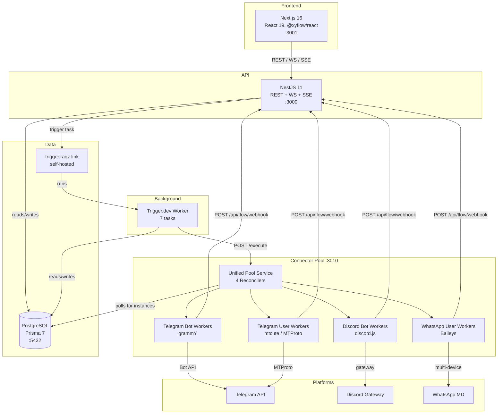
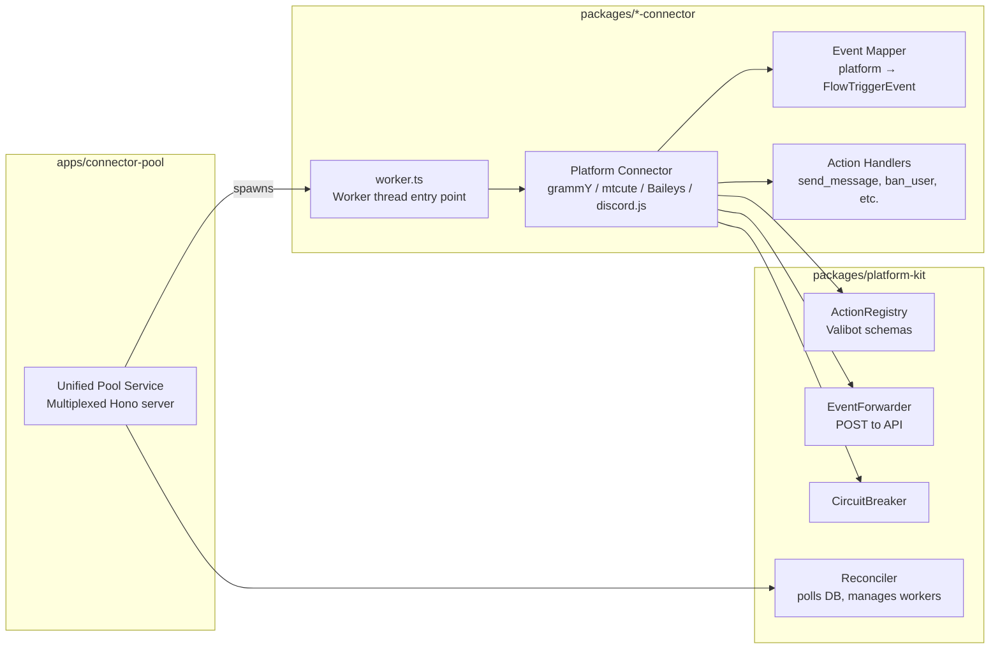
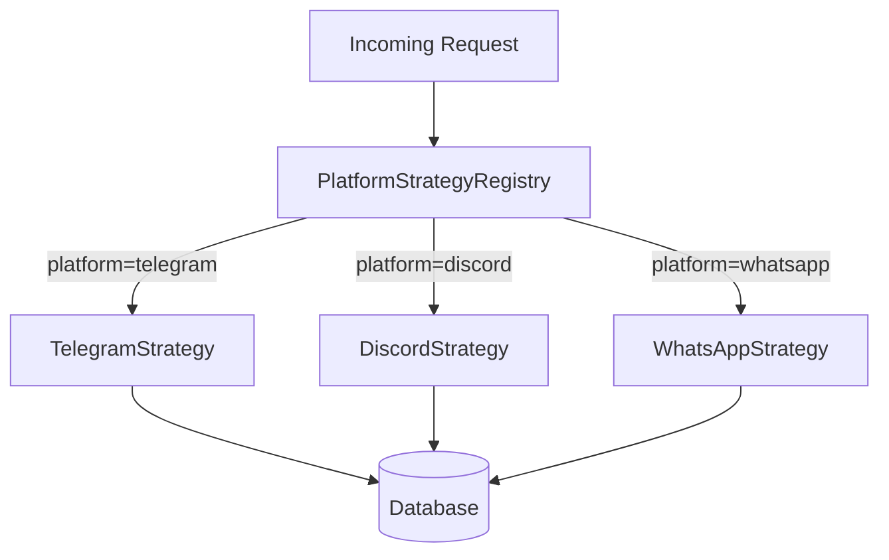
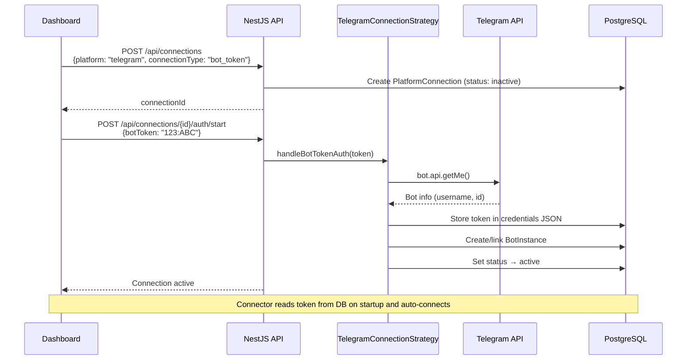
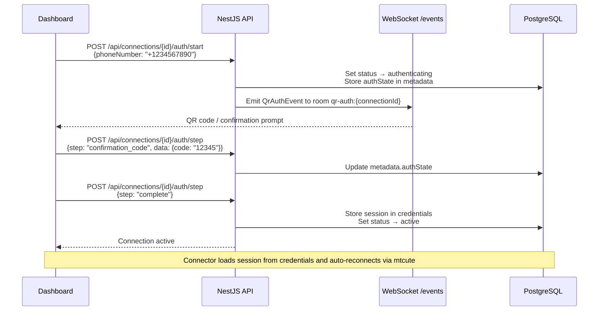
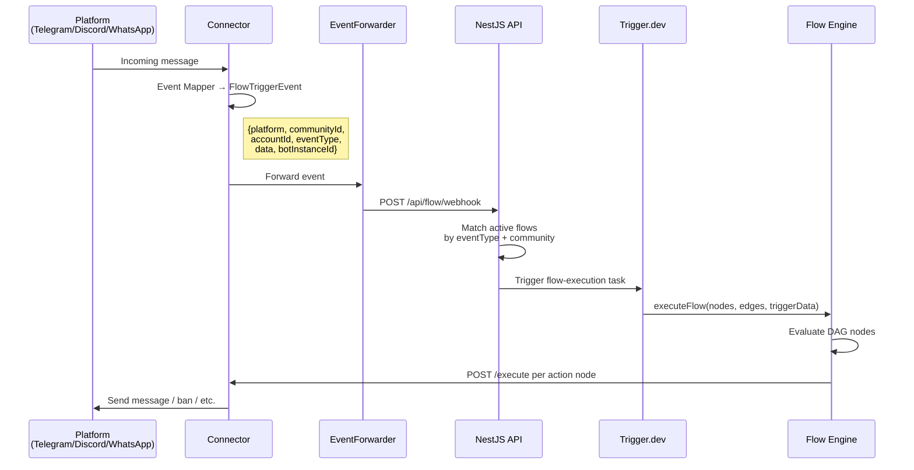
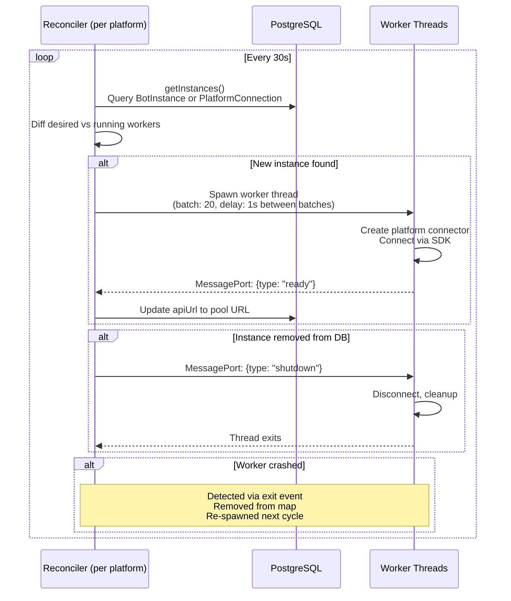
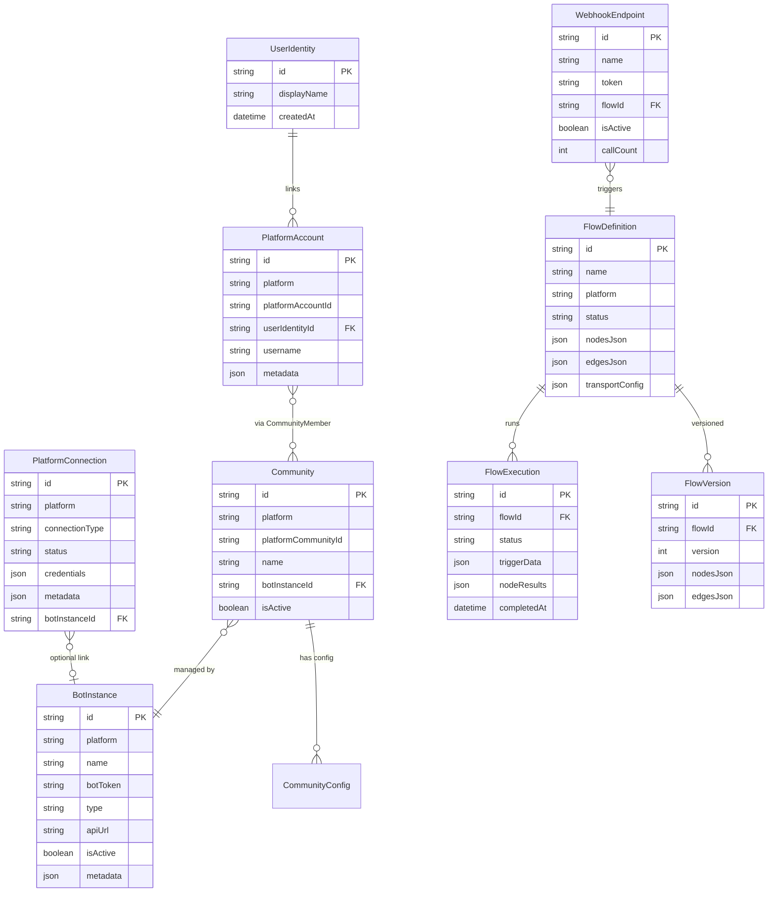
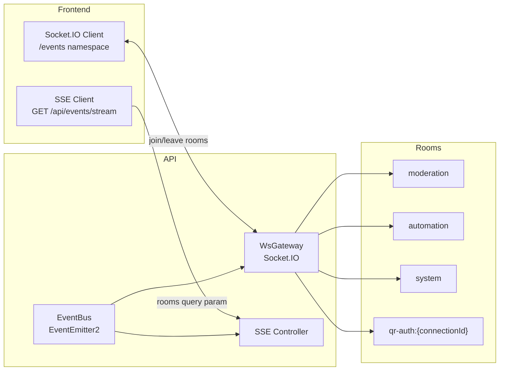

# Flowbot System Design

Multi-platform bot management platform with admin dashboard, visual flow builder, and background job workers. pnpm monorepo, 13 workspaces.

---

## 1. System Overview



---

## 2. Platform Architecture

### Connector Pattern

Every platform follows the same three-layer pattern:



All connectors run as worker threads inside the unified pool service. No tokens or credentials are needed at startup — the pool polls the database for active instances and spawns workers dynamically. The pool exposes a single HTTP API:

| Endpoint | Purpose |
|----------|---------|
| `POST /execute` | Execute an action (`{ action, params, instanceId }`) — routes to correct worker |
| `GET /health` | Aggregated health across all pools |
| `GET /pools` | List all pool types with per-pool worker counts |
| `GET /instances` | List all workers across all pools |
| `GET /instances/:id/health` | Individual worker health |
| `POST /instances/:id/restart` | Restart a specific worker |
| `GET /metrics` | Per-worker action/error counts |

### Platform Discriminator

Every entity has a `platform` string field. Platform-specific logic lives in strategy classes selected at runtime:



---

## 3. Key Flows

### 3a. Connection Auth (Telegram Bot Token)



### 3b. Connection Auth (Telegram User / MTProto)



### 3c. Message Routing



### 3d. Flow Execution

```mermaid
flowchart TB
    START([flow-execution task triggered]) --> FETCH[Fetch FlowDefinition from DB<br/>Validate status = active]
    FETCH --> CREATE[Create FlowExecution record<br/>status: running]
    CREATE --> PARSE[Parse nodesJson + edgesJson<br/>into FlowNode[] + FlowEdge[]]
    PARSE --> ENRICH[Enrich trigger data<br/>cross-bot context]
    ENRICH --> EXEC[Execute DAG]

    subgraph "DAG Evaluation (executor.ts)"
        EXEC --> TOPO[Topological sort nodes]
        TOPO --> EVAL{Next node?}
        EVAL -->|yes| TYPE{Node type?}
        TYPE -->|condition/switch| BRANCH[Evaluate condition<br/>choose branch]
        TYPE -->|send_message/ban/etc| ACTION[Queue action for dispatch]
        TYPE -->|delay/set_variable| INTERNAL[Execute internally]
        TYPE -->|user_*| USERACT[Queue for pool dispatch]
        BRANCH --> CACHE
        ACTION --> CACHE
        INTERNAL --> CACHE
        USERACT --> CACHE
        CACHE[Store in nodeResults<br/>LRU cache for pure nodes] --> EVAL
        EVAL -->|no| DISPATCH
    end

    DISPATCH[Dispatch queued actions]
    DISPATCH --> POOL[POST /execute to connector pool<br/>for all actions (bot + user_*)]
    POOL --> DONE
    DONE[Update FlowExecution<br/>status: completed/failed<br/>store nodeResults]
```

### 3e. Unified Pool Reconciliation

The connector pool runs 4 reconcilers — one per platform/type combination:

| Reconciler | DB Table | Filter |
|------------|----------|--------|
| `telegram:bot` | `BotInstance` | `platform='telegram', isActive=true` |
| `discord:bot` | `BotInstance` | `platform='discord', isActive=true` |
| `telegram:user` | `PlatformConnection` | `platform='telegram', connectionType='mtproto', status='active'` |
| `whatsapp:user` | `PlatformConnection` | `platform='whatsapp', status='active'` |



---

## 4. Data Model (Core Tables)



---

## 5. Workspace Map

| Workspace | Role | Why it exists |
|-----------|------|---------------|
| `apps/api` | Central REST/WS/SSE API | Single source of truth for all data, auth, and orchestration |
| `apps/frontend` | Admin dashboard | Visual flow builder, connection management, analytics |
| `apps/trigger` | Background job worker | Long-running tasks (flow execution, broadcasts, analytics) off the API hot path |
| `apps/connector-pool` | Unified connector pool | Manages all platform connectors as worker threads, polls DB for instances |
| `packages/platform-kit` | Shared connector infra | ActionRegistry, EventForwarder, CircuitBreaker, Reconciler, pool server |
| `packages/telegram-bot-connector` | Telegram Bot API lib | grammY-based connector with typed actions and event mapping |
| `packages/telegram-user-connector` | Telegram MTProto lib | mtcute-based connector for user account automation |
| `packages/whatsapp-user-connector` | WhatsApp lib | Baileys-based connector for WhatsApp multi-device |
| `packages/discord-bot-connector` | Discord lib | Discord.js-based connector with typed actions and event mapping |
| `packages/db` | Database layer | Prisma schema, client, migrations (35+ models) |
| `packages/flow-shared` | Flow types | Shared node types, edge types, and utilities for flow builder |

---

## 6. Real-Time Communication



| Room | Events | Use case |
|------|--------|----------|
| `moderation` | Warnings, bans, mutes | Live moderation feed |
| `automation` | Job status updates | Broadcast/crosspost progress |
| `system` | Generic system events | Health, errors |
| `qr-auth:{id}` | QR code state changes | Connection auth progress |
